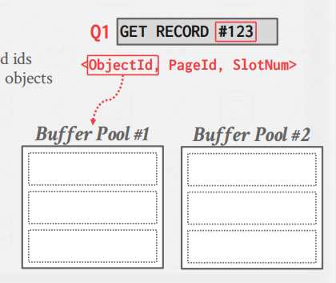
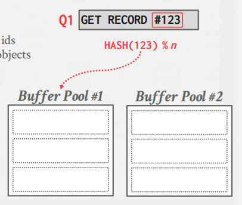
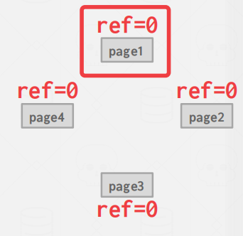
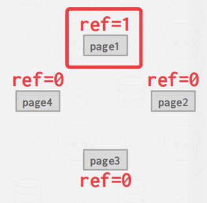
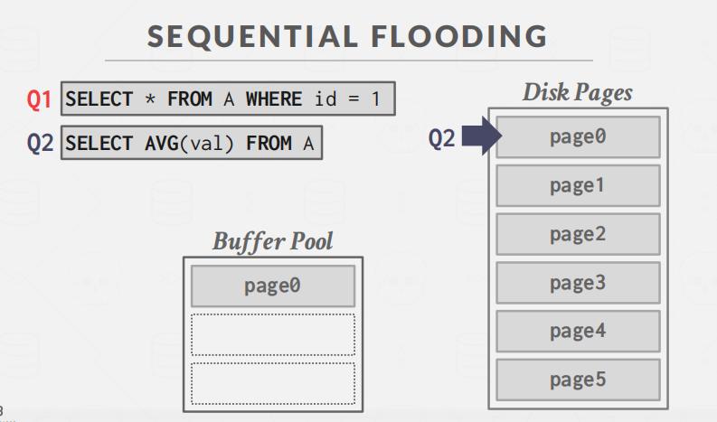
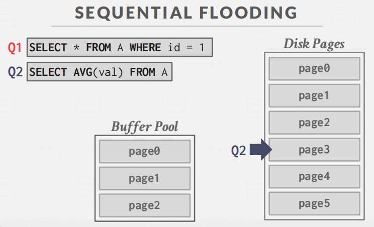
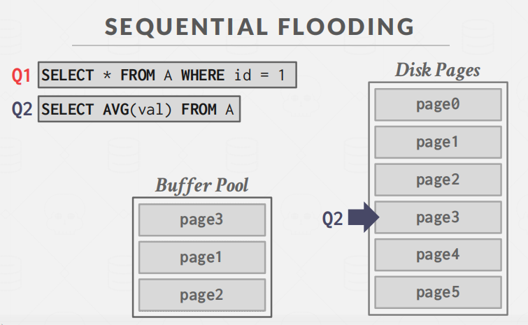
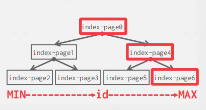

# Buffer-Pool

参考资料：

- [CMU 15445 学习笔记—4 Buffer Pool](https://mp.weixin.qq.com/s?__biz=MzI0Njg1MTUxOA==&mid=2247485604&idx=1&sn=f1ff04e142d7aeb07d67c4415e860a94&chksm=e9b9ba75dece33633144b1caaaacbf87f71a97cea4112ee1d71efb55f2ba99c6e2b2d0f6bbf2&scene=178&cur_album_id=2001188853730082817#rd)

## Preface

Buffer Pool是从磁盘读取的页面的内存缓存（理解就是一块**内存区域**）。它本质上是在数据库内部分配的一个很大的存储区域，用来存储从磁盘获取的页面。

和OS类似，也是由于**局部一致性原理**。

**缓冲区池的内存区域被组织成一个固定大小的页面page数组**。每个数组条目都被称为一个**frame**。

此外，还需要维护一个 **page table**，它是一个哈希表，存储的是 page id 对 buffer pool 中 frame 的一个映射，此外还需要存储一些 page 的元数据信息，例如 page 是否为脏页、page 的引用计数等等。

## Buffer  Pool Manager

有许多方法可以优化缓冲池，以适应应用程序的工作负载。

###  Multiple Buffer Pools

DBMS可以为不同的目的**维护多个缓冲池**（即每个数据库的缓冲池、每个页面类型的缓冲池）。然后，每个缓冲池都可以采用为存储在其中的数据而定制的本地策略。这个方法可以减少锁存器争用，提高局部性。

如何将所需的页面映射到缓冲区池？即实现一条tuple到buffer pools的映射。

2种方法： `object IDs`和`hashing`。

> **object IDs**

对象id涉及到将记录id扩展为具有对象标识符。然后，通过对象标识符，可以维护从对象到特定缓冲区池的映射。即，**Object ID 一般可以是一条 tuple 的隐藏列，它主要记录了 tuple 的磁盘存储位置**。

> **hashing**

**将tuple中的信息做hash，进行映射。**

 

###  Pre-fetching

DBMS还可以根据查询计划通过预抓取页面来进行优化。然后，**在处理第一组页面时，可以将第二组页面预取到缓冲池中**。DBMS在按顺序访问多个页面时，通常使用这种方法。

> **Sequential Scans**

简单的顺序扫描

> **Index Scans**

### **Scan Sharing**

scan sharing 的思路总体来说就是如果一个 query 想要扫描一个表，此时已经有另一个查询也正在扫描这个表了，那么可以将两个查询的操作合并起来，共享同一个 page 的内容。

### **Buffer Pool Bypass**

顺序扫描操作符将不会将获取的页面存储在缓冲池中，以避免开销。相反，内存对正在运行的查询是本地磁盘的。如果操作员需要读取磁盘上连续的大页序列，这将非常有力。（**简单来说，不需要Buffer Pool，直接扫磁盘**）

## Replacement Policer

当DBMS需要释放一个frame来为一个新page页面腾出空间时，它必须决定从缓冲区池中驱逐哪个页面。

我们的目标是：

- 正确
- 精确
- 速度
- 元数据开销

### LRU

LRU ，即 Least Recently Used，最近最少使用原则。

可以为每个 page 分配一个访问的时间戳，当访问了一个 page，则更新该时间戳。当需要淘汰旧的 page 时，直接选择最久未被访问的 page 即可。

摘自:[CMU 15445 学习笔记—4 Buffer Pool](https://mp.weixin.qq.com/s?__biz=MzI0Njg1MTUxOA==&mid=2247485604&idx=1&sn=f1ff04e142d7aeb07d67c4415e860a94&chksm=e9b9ba75dece33633144b1caaaacbf87f71a97cea4112ee1d71efb55f2ba99c6e2b2d0f6bbf2&scene=178&cur_album_id=2001188853730082817#rd)

### Clock

Clock的思想和LRU近似。

我们给每一个页设定一个` reference bit,ref`。当一个页被用到了，ref的值置为1。

接着，我们将 所有 page 看做一个环，用一个“时钟指针”指向一个循环的缓冲区。

- 扫描时，检查页面的位是否设置为1。
- 如果是1，则设置为0。如果不是，那么就移除。

例子：

例如page1被访问到了，ref值置为1

一般会设定一个定时任务，然后我们可以顺序扫描每一个 page，如果 bit 值为 1，则说明该 page 被访问过，就将 bit 重置为 0。如果 bit 为 0，则说明该 page 没有被访问过，则直接清除这个 page。

摘自:[CMU 15445 学习笔记—4 Buffer Pool](https://mp.weixin.qq.com/s?__biz=MzI0Njg1MTUxOA==&mid=2247485604&idx=1&sn=f1ff04e142d7aeb07d67c4415e860a94&chksm=e9b9ba75dece33633144b1caaaacbf87f71a97cea4112ee1d71efb55f2ba99c6e2b2d0f6bbf2&scene=178&cur_album_id=2001188853730082817#rd)

LRU和Clock对于`sequential flooding`的性能很差。

**sequential flooding含义**

例子

首先来了个select查询id=1的页，page0正好符合，将其放到缓冲池中。

接着，这时又来了个查询2，不过这个查询是全表扫描。因此需要不断的加载数据到Buffer Pool中。

这时，查询Q2扫到page3，打算将其加入Buffer Pool中，但是Buffer Pool已经满了，因此选中一页替换出去。

根据更新时间看，会把page0替换掉。

思考：page0替换到底是好还是不好？

答案是不好，因为page0属于热点页，即有人查询过，可能还会查询。

这时，来了个Q3执行Q1相同的操作，又得将page1拉到缓冲池中。

### LRU-K

前面提到的 LRU 算法虽然思路简单，但是也存在一些问题，如果一个频繁访问的热点 page，在短时间内被仅访问一次的页面所替换，那么会使缓存命中率下降，这种情况通常叫做缓存污染。

所以我们可以提升页面访问的次数上限，当达到 k 次时才能够替换其他的页面，所以不难理解传统的 LRU 算法可以看做是 LRU-1。

摘自:[CMU 15445 学习笔记—4 Buffer Pool](https://mp.weixin.qq.com/s?__biz=MzI0Njg1MTUxOA==&mid=2247485604&idx=1&sn=f1ff04e142d7aeb07d67c4415e860a94&chksm=e9b9ba75dece33633144b1caaaacbf87f71a97cea4112ee1d71efb55f2ba99c6e2b2d0f6bbf2&scene=178&cur_album_id=2001188853730082817#rd)

### Localization

根据Mondy老师的视频的意思是不要轻易驱逐其他操作的page，而优先驱逐自己的page。

### Priority Hints

DBMS在查询执行期间知道每个页面的上下文。它可以为缓冲区池提供关于**页面是否重要的提示**。简单说，就是给每个页加以重要程度。

例如一棵树那个页最重要

答案是**根节点**。

> **Dirty Page**

摘自:[CMU 15445 学习笔记—4 Buffer Pool](https://mp.weixin.qq.com/s?__biz=MzI0Njg1MTUxOA==&mid=2247485604&idx=1&sn=f1ff04e142d7aeb07d67c4415e860a94&chksm=e9b9ba75dece33633144b1caaaacbf87f71a97cea4112ee1d71efb55f2ba99c6e2b2d0f6bbf2&scene=178&cur_album_id=2001188853730082817#rd)

dirty page，即脏页，指的是缓存在 buffer pool 中的数据被修改了，但是还没有来得及写到磁盘中。每个 page 都有一个相应的标志位，来表示自己是否是脏页。

如果一个 page 不是脏页，那么在替换该 page 时，系统可以直接将它从 buffer pool 中移除，反之，则需要将 page 中的数据持久化。

一般我们可以启动一个后台进程，定期对脏页进行处理，当将脏页数据写到磁盘后，可以将脏页从 buffer pool移除，也可以直接重置 page 的脏页标志位。

## Other Memory Pools

这些其他内存池可能并不总是由磁盘支持的。取决于实现。

- Sorting + Join Buffers
- Query Caches
- Maintenance Buffers
- Log Buffers
- Dictionary Caches