# Join Algorithms

参考资料：

- [CMU15-445数据库系统：连表算法](https://gaozhiyuan.net/database/cmu-database-systems-join-algorithms.html)

## Preface


> 为什么会有联合开销捏？

**解释**：这是数据库范式化的产物，我们将数据拆分，以此来减少信息重复的量。


这个章节，我们会去关注⼀次只**join两个表**的情况。

我们将专注于使用内等连接算法来执行二进制连接（两个表）

**QUERY PLAN**

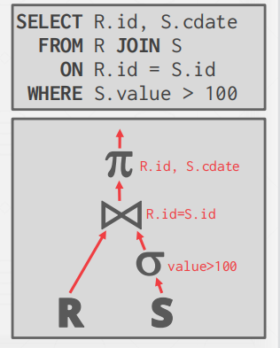

**OPERATOR OUTPUT: DATA**

-  Early Materialization：将外部和内部元组中的属性的值复制到一个新的输出元组中.


-  Late Materialization：仅复制连接键以及匹配元组的记录ID


数据库之所以设计 JOIN Algorithm 的目的就是因为数据库中的数据量通常较大，无法一次性载入内存，使用 JOIN Algorithm 可以减少磁盘 I/O，因此我们衡量 JOIN Algorithm 好坏的标准，就是 I/O 的效率。

**JOIN Algorithm**

-  Nested Loop Join
  - Simple / Stupid 
  - Block 
  - Index 
- Sort-Merge Join 
- Hash Join

【补充】花费分析评判依据。

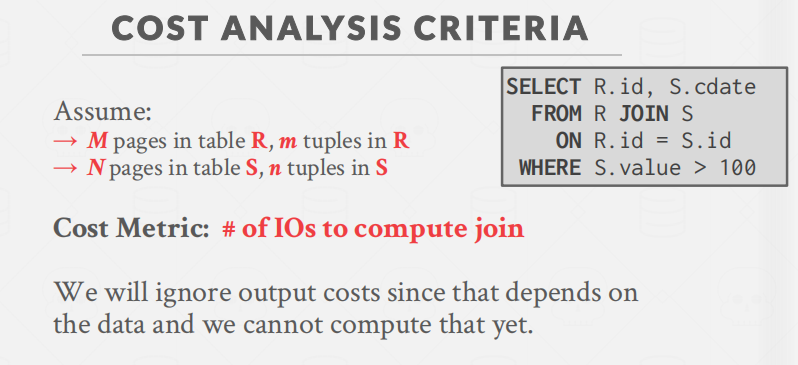

## Nested Loop Join

> **Simple / Stupid **

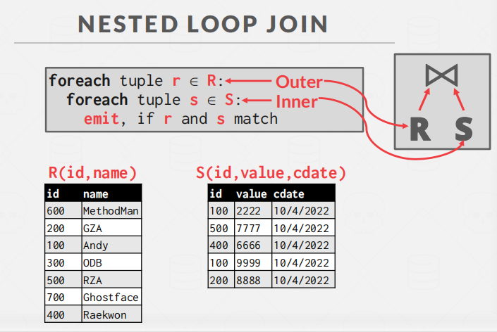

循环嵌套连接就是需要one by one的连接后比较。

join operator左边的输入R代表的是outer tablel，右边的输入S代表的是inner table。

**I/O开销**


M代表左表的页数，m代表行数。右边类似。

举个实际例子，带入数据。


这个开销还是很大的QWQ。

> **BLOCK NESTED LOOP JOIN**

**思想**：将多个tuple打包进page。我们把outer table放在⼀个block（page和block意思一样）中，inner table放在另⼀个block中，对于outer table所⽤的每个block⽽⾔，我们每次会从inner table中拿到⼀个block。我们会让outer table block中的每个tuple和inner table block中的所有tuple进⾏join。直到我们完成了对outer table block中所有tuple的join操作，我们才会和inner table中下⼀个block中的所有tuple进⾏join。

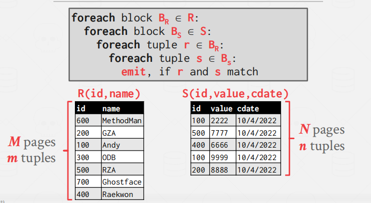

【疑问】

问：那page内部不还是一样要两两比较吗？

答：但是page可以在内存中遍历啊，这与从硬盘中不断地换入tuple到内存是不一样的。


取自： [CMU15-445数据库系统：连表算法](https://gaozhiyuan.net/database/cmu-database-systems-join-algorithms.html)

改进后的开销：


**继续，假设我们拥有较大的内存池。**

如果我们有B个缓冲区可用，该怎么办？

我们可以这么做：

- 使用B-2缓冲区扫描外部表。
- 对内部表使用一个缓冲区，将一个缓冲区用于存储输出。

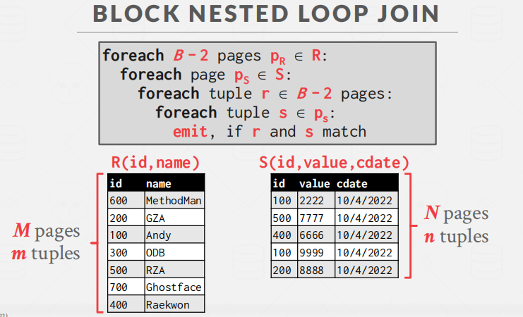

IO开销：


假设整个左表可以放到内存中，那么开销就变成：


> **INDEX NESTED LOOP JOIN**

**INDEX NESTED LOOP JOIN**：对右表做索引，通过索引的方式在B+Tree中做查找。

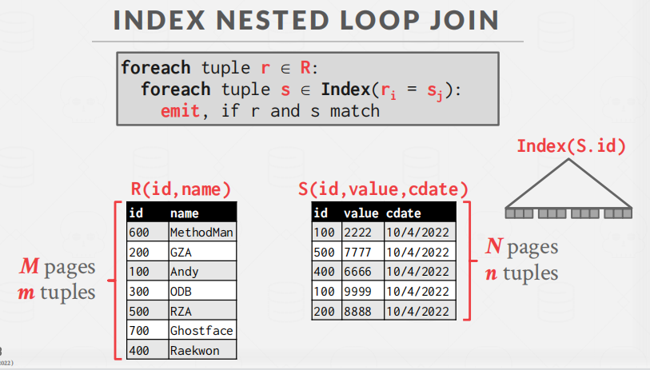

IO开销就变成了


## Sort-Merge Join

**SORT-MERGE JOIN**：先给两个表按 JOIN key 排序，再归并。


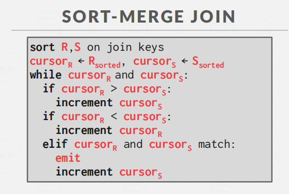

IO开销就变成：


待入数值看看


这个算法会退化，当2表中元素相同时，开销就退化成下面的式子。


## Hash Join


步骤：

1. 先扫描R表，构造哈希表。
2. S的每一行都去hash中查询。（也就是用R表创建hash表，用S表去使用hash表查询）


哈希表的内容：

```bash
1.key:查询正在连接表的属性。
2.value:Early vs. Late Materialization(和之前章节一样)
```

**在做Hash可以用Bloom过滤器进一步优化**

B去hash表中查询的时候，要先经过Bloom过滤器。如果bloom过滤器没有发现hash表中的匹配，就直接干掉，不让继续查询了。

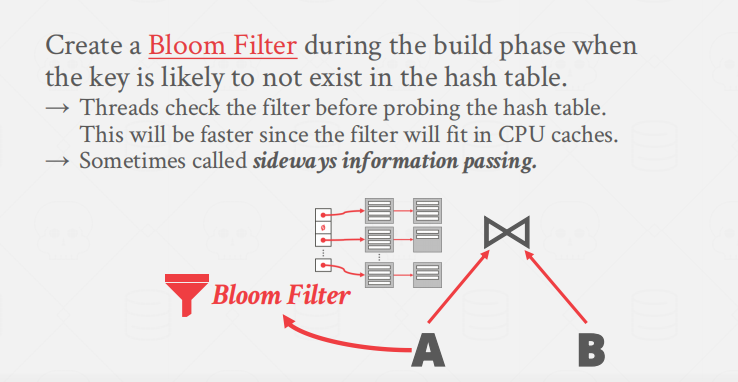

**Bloom过滤器思想**：布隆过滤器可以告诉我们 “**某样东西一定不存在或者可能存在**”，也就是说布隆过滤器说这个数不存在则一定不存，布隆过滤器说这个数存在可能不存在（误判）。

取自： [CMU15-445数据库系统：连表算法](https://gaozhiyuan.net/database/cmu-database-systems-join-algorithms.html)

**PARTITIONED HASH JOIN**

假设R表和S表没有办法放入内存中。

解决方案：对R表和S表用同一个hash函数做哈希。分成的区域叫 桶 或者 分区。

因为，**只要R表和S表能连接的表一定是在同一个桶里**。

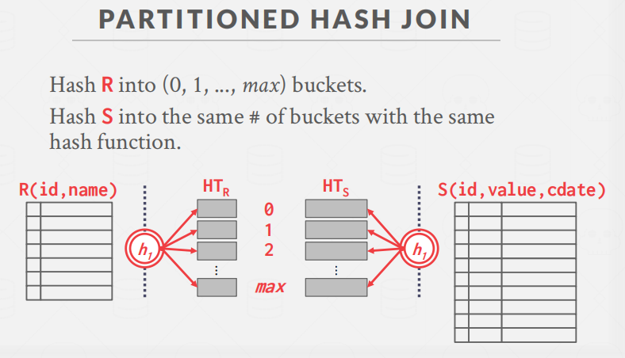

如果一个桶也无法放入内存中呢？那么就不断递归缩小桶的大小。

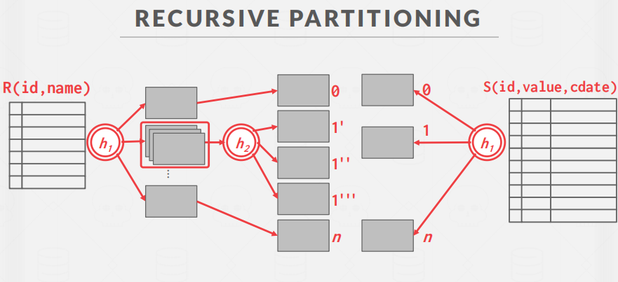


## summary

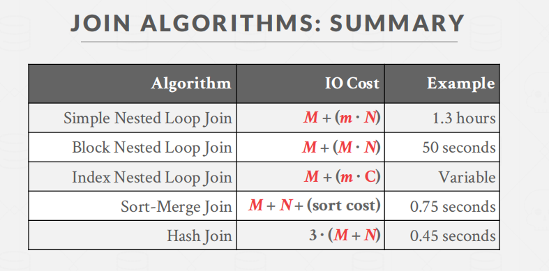