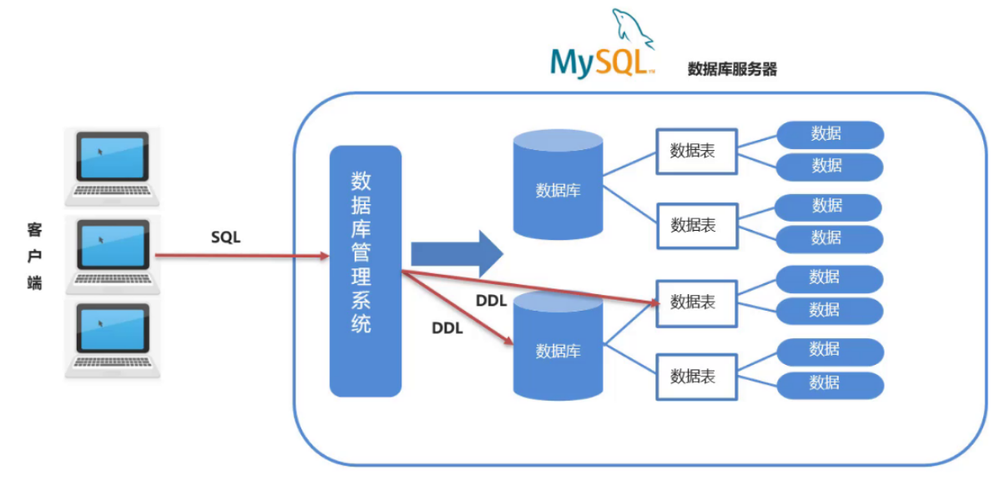

# 02 - Modern SQL

SQL 即结构化查询语言（Structured Query Language），是数据库的标准操作语言，它大致包含了这几种类型：

* DDL(Data Definition Language) ： 数据定义语言，用来定义数据库对象：数据库，表，列等

  DDL简单理解就是用来操作数据库，表等

  

* DML(Data Manipulation Language) 数据操作语言，用来对数据库中表的数据进行增删改

  DML简单理解就对表中数据进行增删改

  

  

* DQL(Data Query Language) 数据查询语言，用来查询数据库中表的记录(数据)

  DQL简单理解就是对数据进行查询操作。从数据库表中查询到我们想要的数据。

  

* DCL(Data Control Language) 数据控制语言，用来定义数据库的访问权限和安全级别，及创建用户

  DML简单理解就是对数据库进行权限控制。比如我让某一个数据库表只能让某一个用户进行操作等。

> 注意： 以后我们最常操作的是 `DML` 和 `DQL`  ，因为我们开发中最常操作的就是数据。

这节剩下的就是SQL语句的讲解啦，可以到一些平台找相关题目练习（Leetcode,牛客），成为一名优秀的`SQL BOY`!