# **Multi-Version Concurrency Control**

参考资料：

- [multi-version-concurrency-control](https://zhenghe.gitbook.io/open-courses/cmu-15-445-645-database-systems/multi-version-concurrency-control)

## MVCC

简而言之，实现 MVCC 的 DBMS 在内部**维持着单个逻辑数据的多个物理版本**。当事务修改某数据时，DBMS 将为其创建一个新的版本；当事务读取某数据时，它将读到该数据在事务开始时刻之前的最新版本。

**核心**

- **Writers don't block readers. 写不阻塞读**

- **Readers don't block writers. 读不阻塞写**

只读事务无需加锁就可以读取数据库某一时刻的快照。如果保留数据的所有历史版本，DBMS 甚至能够支持读取任意历史版本的数据，即 time-travel。

> **Example #1**

事务T1和事务T2分别有时间戳1和2。开始执行之前，数据库保存着A的最开始的版本。这时T1读A。

事务T2开始对A进行写操作，这时在数据库中创建一个新版本A1，Begin的值就是事务2的时间戳。（Begin和End表示分别从几号事务开始用，到记号结束）

同时，需要将A0的End记作2，以及DBMS会维护一张事务状态表。

T1再次读取 A，因为它的时间戳为 1，根据记录的信息，DBMS 将 A0返回给T1。

> **Example #2**

例 2 与例 1 类似，T1 先修改数据 A：

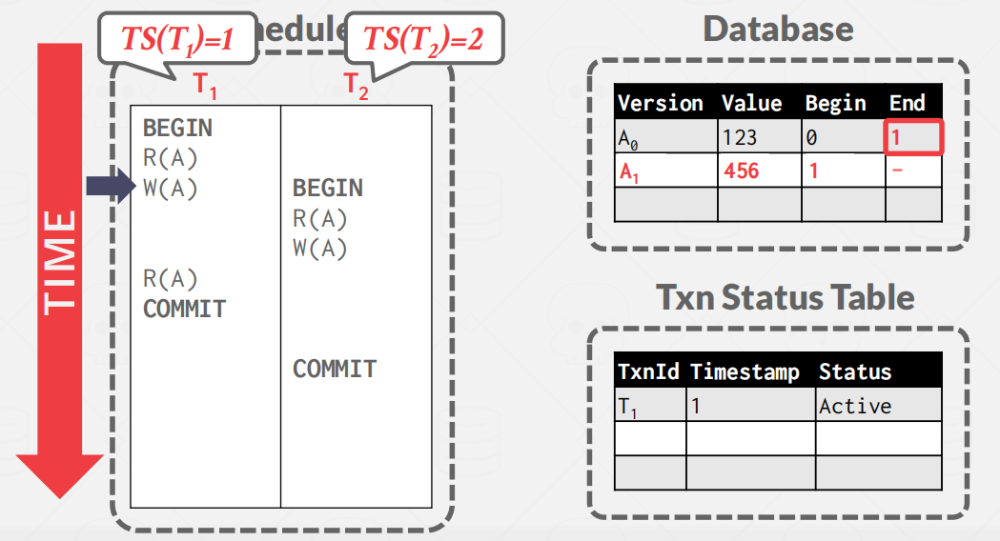

事务T2要读A，但是只能读到A0的版本。因为事务T1未提交。

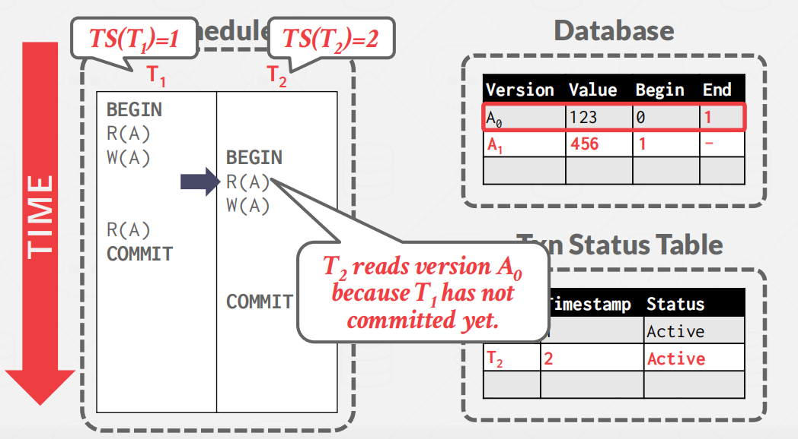

T2想修改 A，但由于有另一个活跃的事务 T1正在修改 A ， T2 需要等待 T1提交后才能继续推进：

T1提交后，T2开始创建A的新版本A2

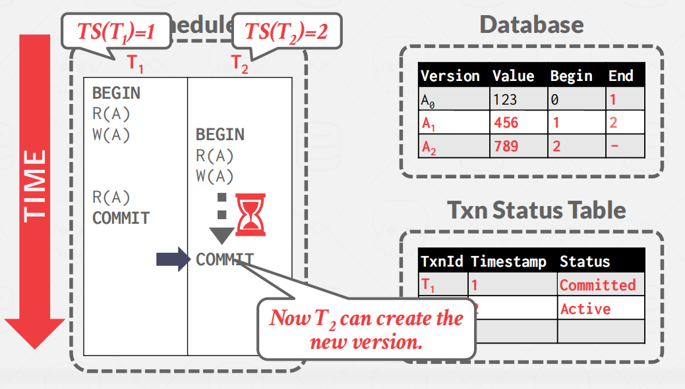

**小结**

MVCC不仅仅是一个并发控制协议。它完全影响了DBMS管理事务和数据库的方式

## Design Decisions

- Concurrency Control Protocol

- Version Storage

- Garbage Collection

- Index Management

- Deletes

### Concurrency Control Protocol

前面课程已经介绍了并发控制协议，MVCC 可以选择其中任意一个：

**Approach #1：**Timestamp Ordering (T/O)：为每个事务赋予时间戳，并用以决定执行顺序

 **Approach #2：**Optimistic Concurrency Control (OCC)：为每个事务创建 private workspace，并将事务分为 read, write 和 validate 3 个阶段处理

 **Approach #3：**Two-Phase Locking (2PL)：按照 2PL 的约定获取和释放锁

### **Version Storage**

这就是DBMS将如何存储逻辑对象的**不同物理版本**，以及事务如何**找到对它们可见的最新版本**。

DBMS使用**元组的指针字段来为每个逻辑元组创建一个版本链，这本质上是一个按时间戳排序的版本链表**。这使得DBMS能够在运行时找到对特定事务可见的版本。索引总是指向链的“头”，根据实现的不同，它是最新的或最老的版本。一个线程遍历链，直到它找到正确的版本。不同的存储方案决定了每个版本的存储位置/内容。

**Approach #1：**Append-Only Storage：新版本通过追加的方式存储在同一张表中

**Approach #2：**Time-Travel Storage：老版本被复制到单独的一张表中 

**Approach #3：**Delta Storage：老版本数据的被修改的字段值被复制到一张单独的增量表 (delta record space) 中

> **Approach #1: Append-Only Storage**

如下图所示，同一个逻辑数据的所有物理版本都被存储在同一张表上，每次更新时，就往表上追加一个新的版本记录，并在旧版本的数据上增加一个指针指向新版本：

Approach #1：Oldest-to-Newest (O2N)：写的时候追加即可，读的时候需要遍历链表 

Approach #2：Newest-to-Oldest (N2O)：写的时候需要更新所有索引指针，读的时候不需要遍历链表

也就是，新版本放在链表头位置还是尾部位置。

> **Approach #2: Time-Travel Storage**

DBMS维护一个单独的表，称为time-travel表，它存储旧版本的元组。在每次更新时，DBMS都会将旧版本的元组复制到time-travel表，并使用新数据覆盖主表中的元组。主表中的元组指针指向time-travel表中的过去版本。

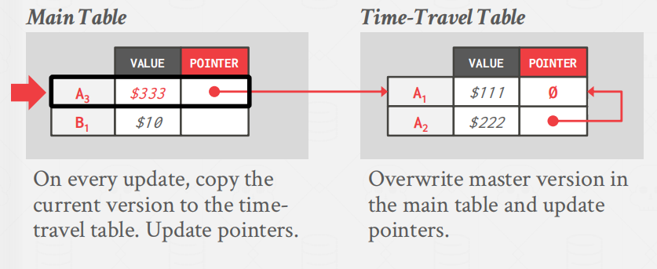

> **Approach #3: Delta Storage**

与time-travel存储一样，DBMS不是整个过去的元组，而是只存储增量，或者在被称为增量存储段中存储元组之间的更改。然后，事务可以通过迭代增量来重新创建旧版本。这导致写的速度比时间旅行存储的速度更快，但读取速度更慢。

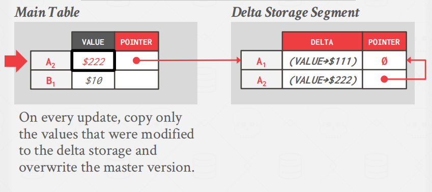

###  Garbage Collection

DBMS需要随着时间的推移需要从数据库中删除可回收的物理版本。如果**没有活动事务可以“看到”该版本**，或者**它是由已中止的事务创建的**，则**该版本是可回收的**。

**Approach #1：Tuple-level：**直接检查每条数据的旧版本数据 。

**Approach #2：Transaction-level：**每个事务负责跟踪数据的旧版本，DBMS 不需要亲自检查单条数据。

> **Approach #1: Tuple-level GC**

1. **Background Vacuuming**

如下图所示，假设有 2 个活跃事务，它们的时间戳分别为 12 和 25：

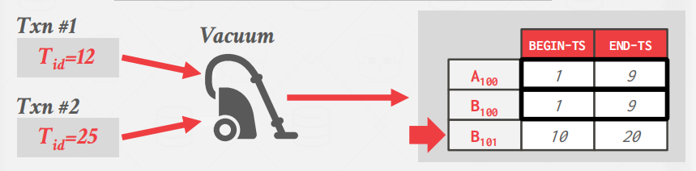

这时有个 Vacuum 守护线程会周期性地检查每条数据的不同版本，如果它的结束时间小于当前活跃事务的最小时间戳，则将其删除(即，**Min(Tid)>Max(End-TS)**)：

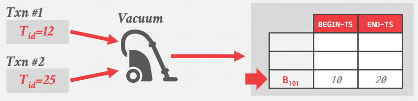

一个简单的优化是维护一个“脏页位图”，它跟踪自上次扫描以来哪些页面已经被修改。这允许线程跳过没有更改的页面

2. **Cooperative Cleaning**

还有一种做法是当 worker thread 查询数据时，顺便将不再使用物理数据版本删除：

> **Approach #2: Transaction-level GC**

在事务级垃圾收集下，每个事务都负责跟踪它们自己的旧版本，因此DBMS就不必扫描元组。.每个事务都维护其自己的读/写集。当事务完成时，垃圾收集器可以使用它来识别要回收哪些元组。DBMS确定由已完成的事务创建的所有版本何时不再可见。

### Index Management

#### Primary Key Index

主键索引直接指向 version chain 的头部。

DBMS更新pkey索引的频率取决于系统在更新一个元组时是否创建了新的版本。

#### Secondary Indexes

-  **Approach #1: Logical Pointers**(逻辑指针，即存储主键值或 Tuple Id)

- **Approach #2: Physical Pointers**(物理指针，即存储指向 version chain 头部的指针)

> **Approach #1: Logical Pointers**

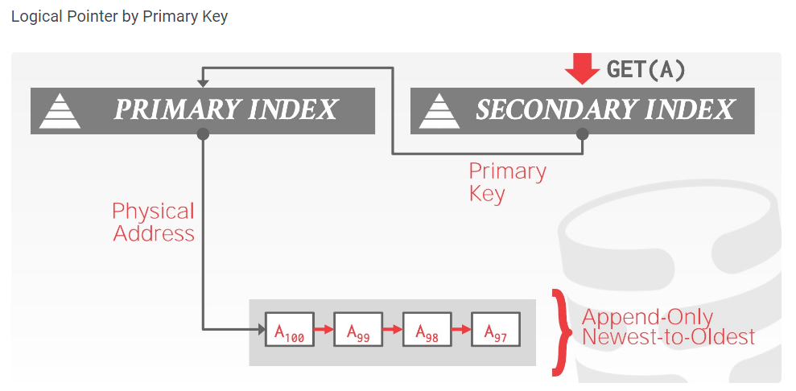

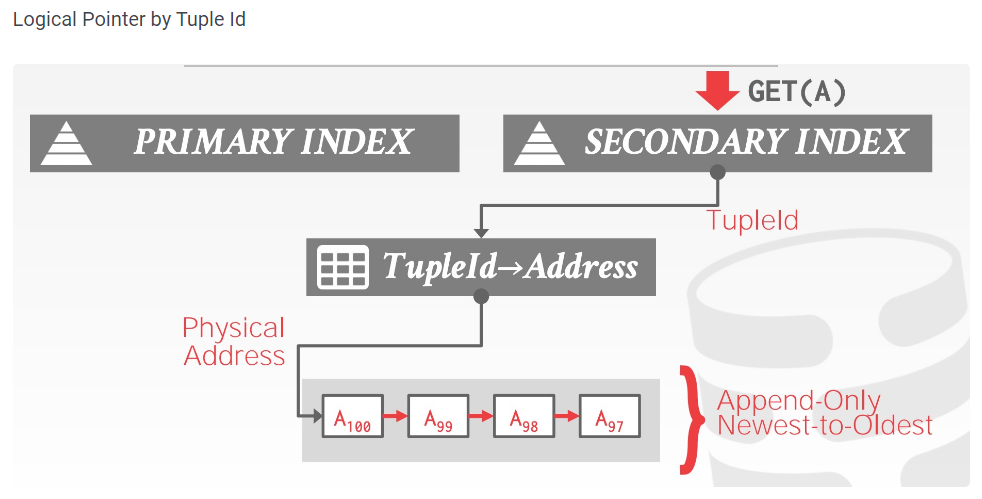

> **Approach #2: Physical Pointers**

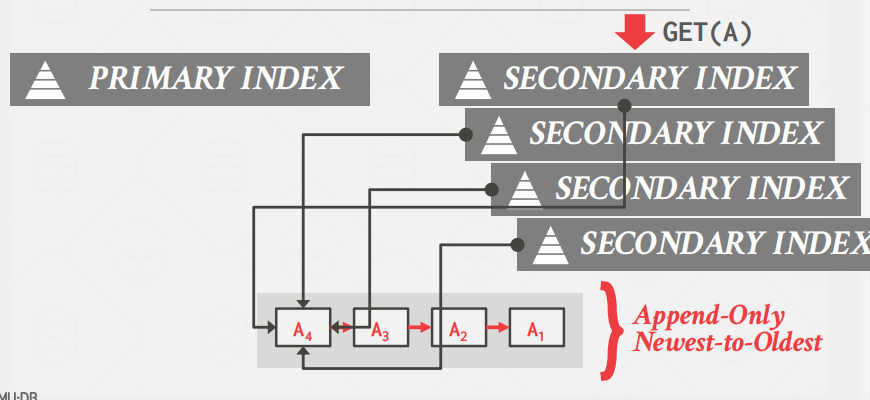

## MVCC Implementations

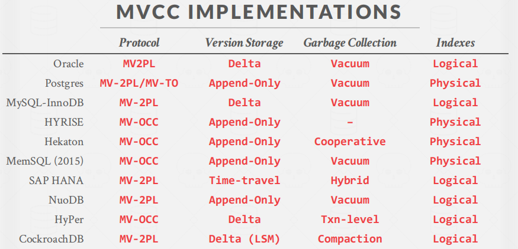