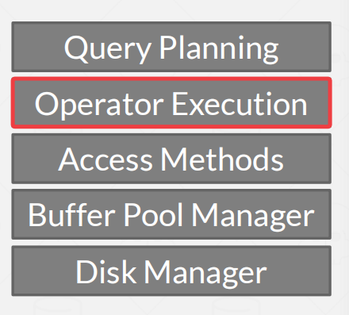
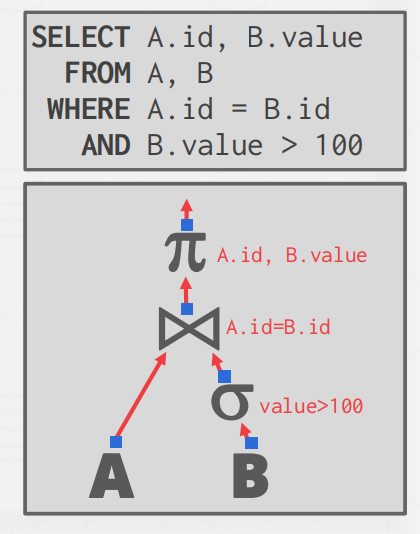
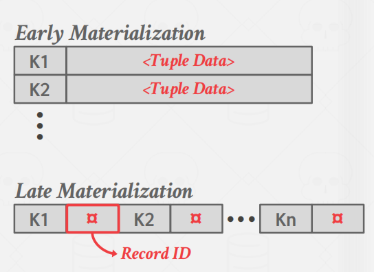
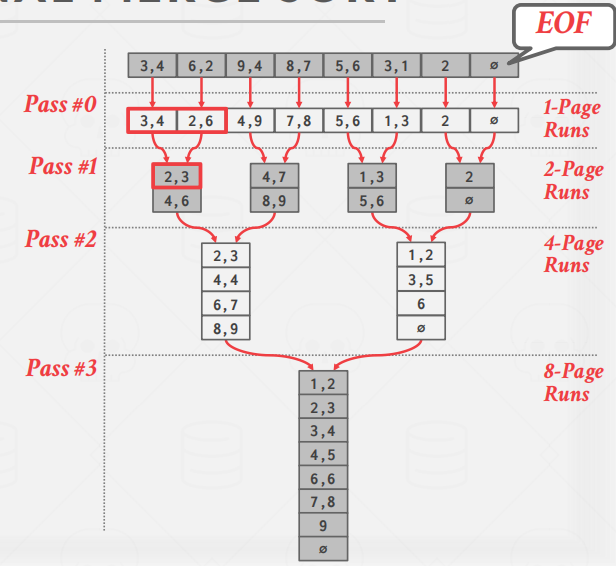
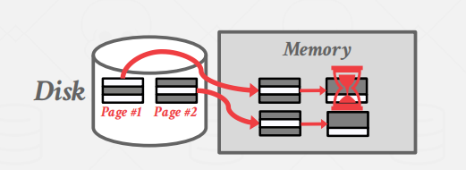
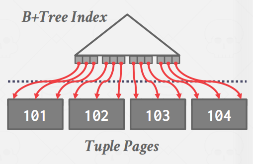
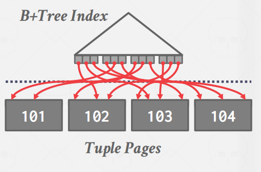
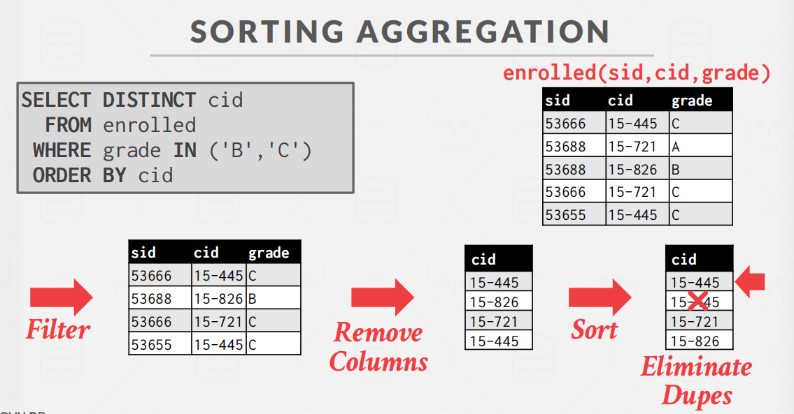

# Sorting&Aggregation-Algorithms

今天讨论的算法都是基于磁盘的，即查询的中间结果也需要存储到磁盘中。我们需要使用缓存池去实现这些算法，以最大化磁盘连续I/O。

**Query Plan**

查询计划指的是指令，或者是数据库系统该如何执⾏⼀个给定查询的⽅式。我们会将查询计划整理为⼀个树形结构或者是⼀个有向⽆环图。

解释：算子组织成树形结构，数据从叶子节点流向根节点，根节点的输出就是查询的结果。

## Sorting

>  **为啥需要排序？**

DBMS是面向硬盘的，即假设硬盘存储巨量数据，不能指望这些面向硬盘的数据库系统所有的结果都保存在内存中。

关系模型/SQL未排序的。因此，可能一些操作会用到排序。

- 查询可能要求元组以特定的方式进行排序（order by ）
- DISTINCE 的工作也是先排序，然后去重。

> **排序算法**

如果数据量小，可以直接在内存中完成排序。例如（冒泡，归并，快排）

但是数据量较大，那么数据就不适合都放在内存，那么需要使用一种读写磁盘页面的成本的技术。

> **EXTERNAL MERGE SORT**

**EXTERNAL MERGE SORT**的思想：分治算法将数据分割成单独的运行，分别对它们进行排序，然后将它们组合成更长的再进行排序。

算法可以分为2个阶段：

1. **Sort**：对能放进内存的数据块排序，然后将排序的块写回磁盘上的文件。
2. **Merge**： 算法将两个（可能是多个，两个的叫做two-way）排好序的子数据块合并成一个大数据块。

【补充】

- **early materialization**：早物化。
- **late materialization**：晚物化。

如上图所示，假设Key的含义是年龄，我们需要对其排序。但是往往一个人的数据不单单只有年龄，还有其他信息(姓名，电话)。因此早物化就是加其他信息都包含进去一起排序，晚物化则是只排序Key。

> **2-WAY EXTERNAL MERGE SORT**

**前提：**

数据被分成N个page。

DBMS有B个 buffer pool pages来存储输入和输出数据。

**排序过程如下图所示：**

第一阶段，是先从Disk中取出page2到内存进行排序。将排序好的块再放回Disk去。

第二阶段，同理第一阶段，将Disk中page1取出放到内存排序。将排序好的块再放回Disk去。

第三阶段，将第一阶段排序好的Page和第二阶段排序好的Page都取到内存中，同时，内存另外开个页面，存放中间结果，那么就换产出如上图最后所示的结果。

**8个页的排序**

接着，就可以将2-way进行推广成一般情况---》`GENERAL EXTERNAL MERGE SORT`。

> **Double Buffering Optimization**

在后台预取下一次运行，并在系统处理当前运行时将其存储在第二个缓冲区中。

好处：这样通过连续使用磁盘减少了每一步I/O请求的等待时间。

> **Using B+ Trees**

如果必须被排序的表已经在排序属性(s)上有一个B+Tree索引，那么我们可以使用它来加速排序。那么可以直接使用B+树排序，而不是用外排序。

-  Clustered B+Tree

这种情况可以遍历到最左边的叶节点，然后从所有叶节点中检索元组。这总是比外部排序更好，因为没有计算成本，而且所有磁盘访问都是顺序的。

-   Unclustered B+Tree

这种情况有点糟，因为每个record可能在不同的页中，所有几乎每一个record访问都需要磁盘读取。

## Aggregations

聚集算子就是将多个元组的单个属性的值计算成为单个标量值。

实现聚集有两种方法

(1) 排序 (2) 哈希

### Soring Aggregation

排序聚集：先排序后去重

### Hasing Aggregation

由于可能有些操作（如`GROUP BY`和`DISTINCT`算子）最终的数据不需要是排好序的，输出结果都不需要进行排序。

那么Hashing就是一个更好的选择，因为不需要排序，而且哈希计算更快。

-  **Phase 1 – Partition:**
    使用哈希函数h1，根据目标的hash key将tuple分割到磁盘中的不同分区。这可以将所有匹配的tuple放在同一个分区中。DBMS通过输出缓冲区将分区溢出（spill）到磁盘上。
- **Phase 2 – ReHash:**
    对磁盘上的每一个区，将其页面读入内存，并根据第二个哈希函数h2, 建立一个内存哈希表。通过这个哈希表的每一个桶，把匹配的tuple汇聚在一起。计算聚合。这假设每个分区都可以被内存容纳。
- 在ReHash阶段，DBMS可以存储形式为（GroupByKey -> RunningValue）的配对，以计算聚合。RunningValue的内容取决于聚合函数。要在哈希表中插入一个新tuple。
  - 如果它找到一个匹配的GroupByKey，那么就适当地更新RunningValue。
  - 否则就插入一个新的（GroupByKey→RunningValue）对。

