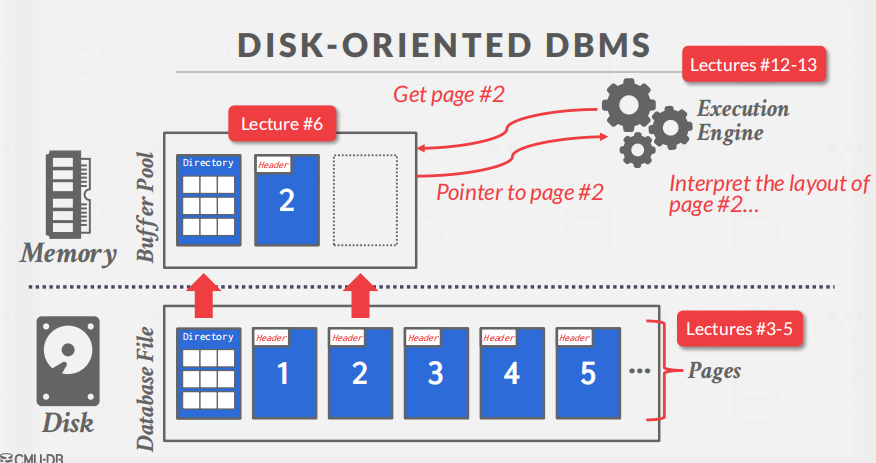
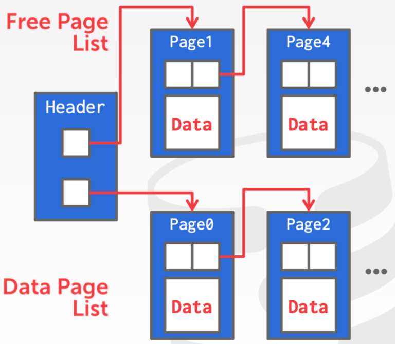
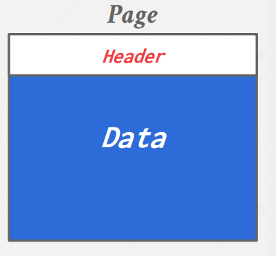
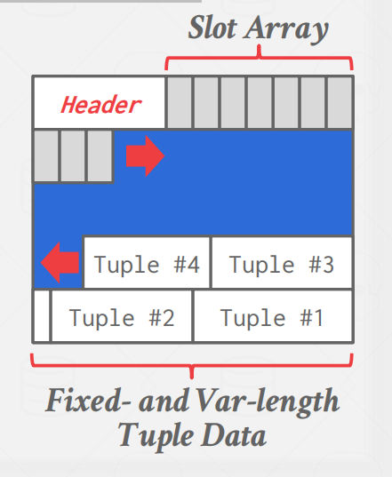
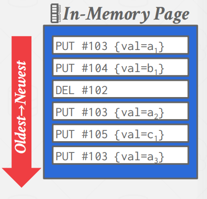
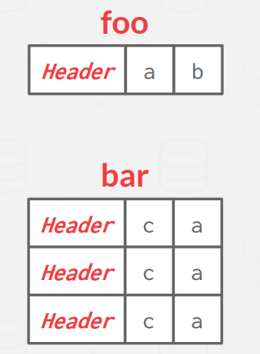
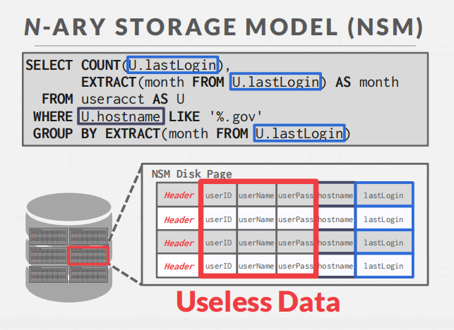
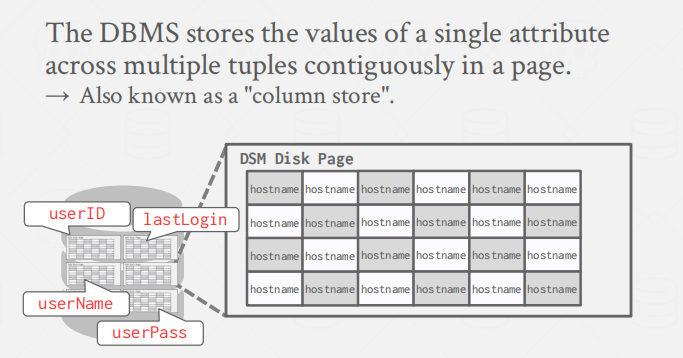

# 03 - Storage Manager

参考资料

- [CMU 15445 学习笔记—3 Storage Manager](https://mp.weixin.qq.com/s/AVSt6AismqlVwbPCEr2EOQ)

- [CMU15-445数据库系统：存储引擎](https://gaozhiyuan.net/database/cmu-database-systems-database-storage.html)

## Preface

一个数据库系统由以下几个不同的部分组成

- Query Planning
- Operator Execution
- Access Methods
- Buffer Pool Manager
- Disk Manager

课程将从底层往上层介绍。这章介绍`Disk Manager`。

## Intro

DBMS假定数据库的主存储位置在非易失性磁盘上。

数据库中，内存和磁盘的结构和关系大致如下图，磁盘上的数据通常以 page 为单位进行组织，内存中维护了一个缓冲池 buffer pool，缓存了磁盘中的 page。

当上层的执行引擎需要读写数据时，首先从 buffer pool缓冲池中获取数据，如果 buffer pool 中没有，则从磁盘中加载到 buffer pool，然后返回到执行引擎中。

>  **为什么不直接使用操作系统呢？**

DBMS可以使用内存映射（mmap）将文件的内容存储到程序的地址空间中

`mmap`的概念：`mmap`是Unix/Linux系统提供的一种内存映射文件的机制，它允许一个进程将一个文件或者其他对象映射到进程的地址空间中，从而让进程可以直接读写这个文件或对象而无需进行文件IO操作。在内存映射文件中，进程的内存空间会被分为若干个页，每个页与文件中的若干个字节对应。当进程访问这些内存页时，对应的字节就会被自动读取或写入。

不使用的原因：

- 以正确的顺序将脏页刷到磁盘
- 特定的预读策略
- buffer 替换策略
- 线程/进程调度

总之，数据库系统希望自己对Disk进行管理。

##  File Storage

大多数数据库系统中的磁盘数据都是以 page 为单位组成。

**数据库Page是一个固定大小的数据块**，一个page能够保存任何东西，可以保存数据库里面的tuple，也可以保存元数据、索引、日志。每个 page 都有一个唯一的标识，称为 page id。

硬件page、操作系统page和数据库page：

我们将怎么管理这些页呢？

不同的dbms以不同的方式管理磁盘上文件中的页面

- Heap File Organization 
- Tree File Organization 
-  Sequential / Sorted File Organization (ISAM) 
-  Hashing File Organization

> **Heap File**

堆文件是以随机顺序存储的元组的无序集合。

堆文件有2种组织方式

- linked list
- page directory

**Linked List**

linked list 是按照链表的方式组织 page。

链表头有两个指针，一个指向 free page list，表示空闲的 page 列表，一个指向 data page list，指向实际存储数据的 page。

**Page Directory**

page directory 维护了一个特殊的 page，这个page存储着其他page的信息。

##  Page Layout

每个page都包含一个关于page内容的元数据的标题。

- header：保存一些元信息，比如 Page Size、checksum、dbms version、 Transaction Visibility等
- data：header 之后的部分叫做 slot array，每一个 solt array 都存储了 tuple 的开始位置，这样能够快速定位到每条记录。保存实际的tuple。

**Page 组织方式**

- Tuple-oriented
- Log-structured

> **Tuple-oriented**

跟踪页面中的元组数量，然后在末尾附加一个新的元组。

缺点：

- 删除操作需要遍历寻找空位
- 无法处理变长的数据记录（tuple）

因此，提出了 slotted page 。

**slotted page**

系型数据库中常用的组织方式叫做 slotted page，如下图所示。

slotted  array将slotted 映射到tuple的起始位置偏移量。

slot是从前往后，tuple是从后往前跟。

> **Log-structured**

DBMS存储包含对元组的更改（输入、删除）的日志记录，即存储这些如何创建tuple以及修改tuple的相关信息

可以对日志进行压缩。

##  Tuple Layout

一个元组本质上是一个字节序列。

tuple 中还可以分为 header 和 attribute data 两部分。

heaher会存一些信息，例如tuple 的可见性（用于并发控制），用于判断 null 列的 bit map 等等。

 **denormalize tuple data**

有时，为了提高操作性能。DBMS 会在存储层面上将有关联的表的数据预先 join 起来，称作 `denormalize`。

DBMS可以在物理上去规范化（例如，“预连接”）相关的元组，并将它们存储在同一个页面中。

- 可能会减少常见工作负载模式的I/O量
- 使更新的成本更高。

## **Storage Model**

OLTP，即 On-Line Transaction Processing，在线事务处理，其特征是读写简单，通常是读/写一小部分数据，并且事务可保证数据的一致性。

OLAP，即 On-Line Analytic Processing，在线分析处理，其特征是查询复杂，需要读取大批量数据进行统计分析。

目前常见的数据存储模型包括：

- 行存储：N-ary Storage Model (NSM)
- 列存储：Decomposition Storage Model (DSM)

> **行存储**

NSM(行存储) 将一个 tuple 的所有属性在 page 中连续地存储，这种存储方式非常适合 OLTP 场景

行存更适合OLTP，因为能够非常方便的更新或者获取到某一条（或几条）具体的数据（点查）。

> **列存储**

**列存储**：DBMS在页面中连续存储单个属性的值

列存更适合 OLAP 类型的数据库。