# Two-Phase-Locking

参考资料：

- [Two Phase Locking](https://zhenghe.gitbook.io/open-courses/cmu-15-445-645-database-systems/two-phase-locking)

上节介绍了通过 WW、WR、RW conflicts 来判断一个 schedule 是否是 serializable 的方法，但**使用该方法的前提是预先知道所有事务的执行流程**，这与真实的数据库使用场景并不符合，主要原因在于：

1. **请求连续不断**。时时刻刻都有事务在开启、中止和提交
2. 显式事务中，**客户端不会一次性告诉数据库所有执行流程**

因此我们需要一种方式来保证数据库最终使用的 schedule 是正确的 (serializable)。不难想到，保证 schedule 正确性的方法就是**合理的加锁 (locks) 策略**，2PL 就是其中之一。

## Lock Types

回顾一下`Locks`和`Latches`的概念（`Locks`：针对事务，`Latches`:之前提到是在树上操作是加的）

本节关注的是事务级别的锁，即`Locks`

- **S-LOCK**: Shared locks for reads - 共享锁 (读锁)

- **X-LOCK**: Exclusive locks for writes - 互斥锁 (写锁) 

二者兼容性矩阵

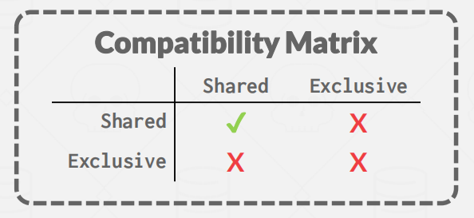

如下图所示：DBMS 中有个专门的模块，**lock manager，负责管理系统中的 locks**，每当事务需要加锁或者升级锁的时候，都需要向它发出请求，**lock manager 内部维护着一个 lock table，上面记录着当前的所有分配信息**，lock manager 需要根据这些来决定赋予锁还是拒绝请求，以保证事务操作重排的正确性和并发度。

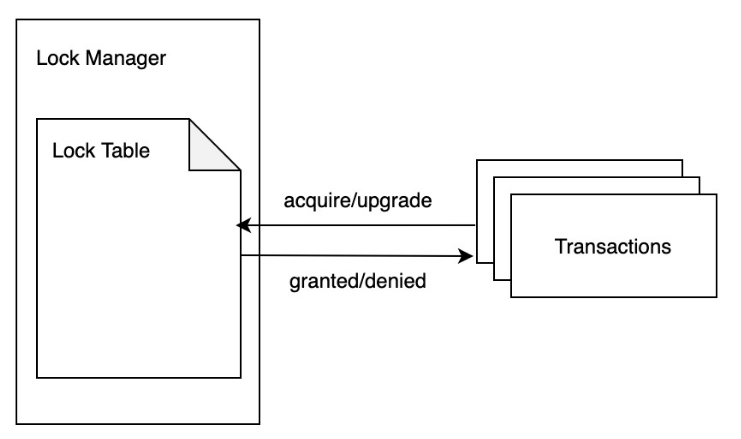

一个Schedule的过程如下：

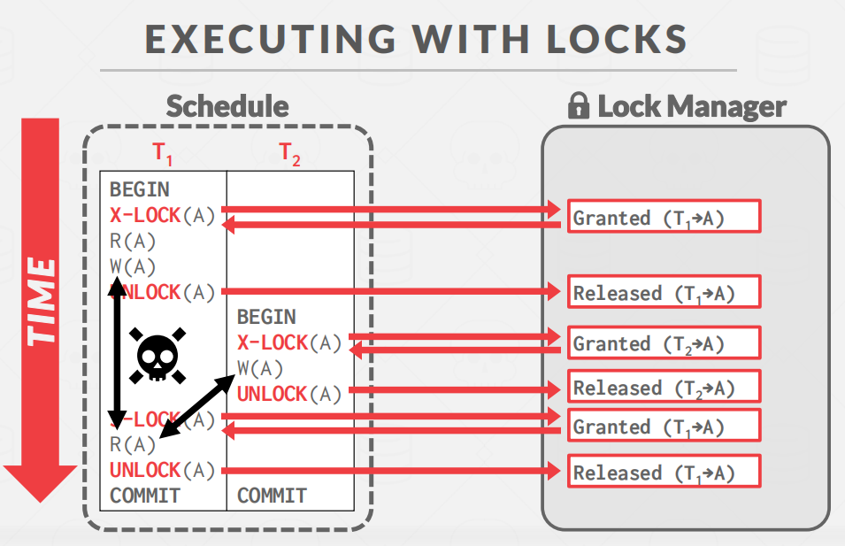

注意：单纯如上过程的加锁是存在问题的。**事务 T1 前后两次读到的数据不一致**，即Unrepeatable Read。也就是出现了幻读，这与顺序执行的结果并不一致。于是需要加强🔒策略。

## Two-Phase Locking

**两阶段锁定（2PL）是一种并发控制协议，它决定了txn在运行时是否可以访问数据库中的对象。该协议不需要知道txn将提前执行的所有查询，仅凭已知的信息即可。**

**2PL**，两个阶段：**Growing** 和 **Shrinking**：

- **Growing**
- 每个txn都向DBMS的锁管理器**请求它所需要的锁**。（**即只能加锁**）
  - 锁管理器会授予/拒绝锁定请求。
- **Shrinking**
  - txn只允许释放/降级它之前获得的锁。它无法获得新的锁。（**即无法加锁**）

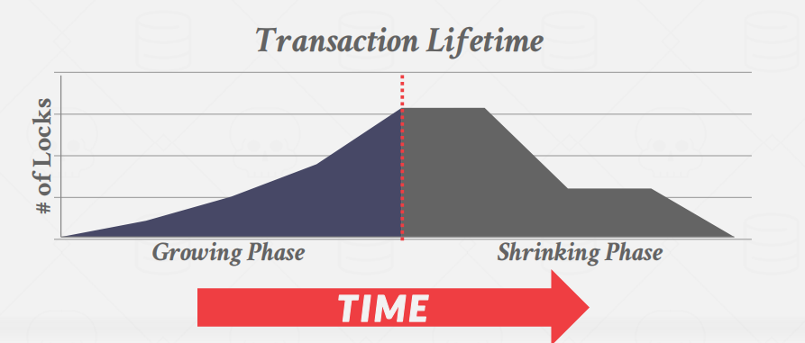

下面这种情况就违背了2PL。

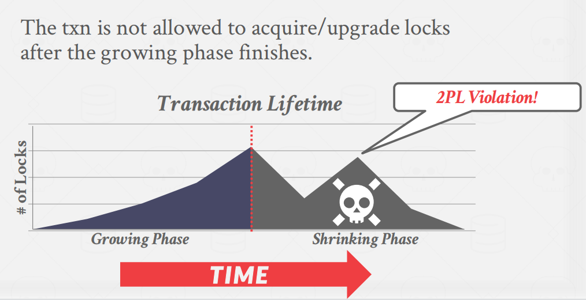

一个例子：

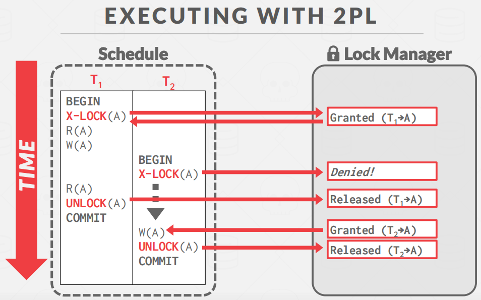

**2PL 本身已经足够保证 schedule 是 serializable，通过 2PL 产生的 schedule 中，各个 txn 之间的依赖关系能构成有向无环图。**

但是，但 **2PL 可能导致级联中止 (cascading aborts)**

**解释**：T1事务对A值进行读写，紧接着T2事务对T1事务读写后的A值进行操作。但是最后T1事务并未提交。这个过程就是所谓的级联中止。

这时，就有了2PL的加强版/变种。（ **Strong Strict 2PL ** /  **Rigorous 2PL**）

**Rigorous 2PL**的想法是基于2PL改进的，因为之所以会出现级联中止，是因为在事务没提交之前就对一些变量解锁，那么**Rigorous 2PL**干脆就在事务提交后再对所有锁进行释放。

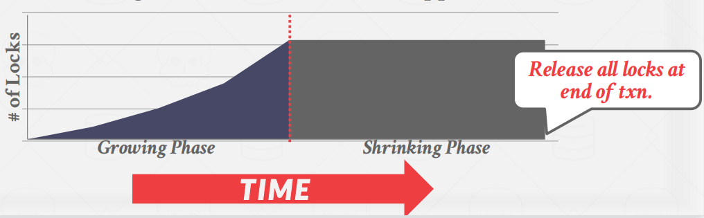

这样，**Rigorous 2PL** 可以**避免级联中止**，而且回滚操作很简单。

**看个例子**

- T1：从 A 向 B 转账 100 美元
- T2：计算并输出 A、B 账户的总和

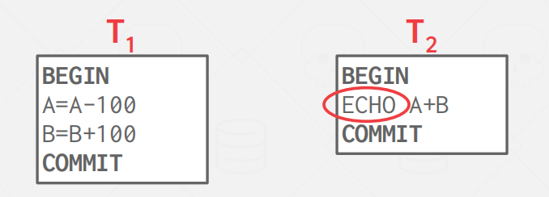

第一种情况：**NoN-2PL**

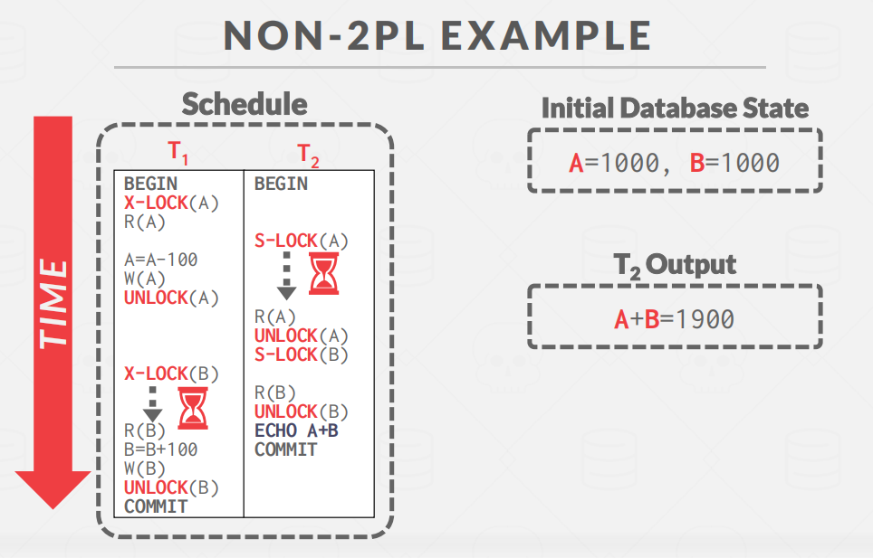

第二种情况：**2PL**

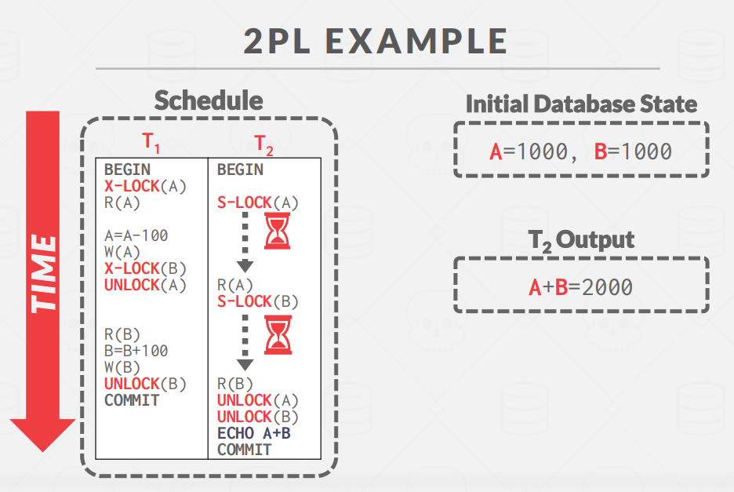

第三种情况：**Rigorous 2PL** 

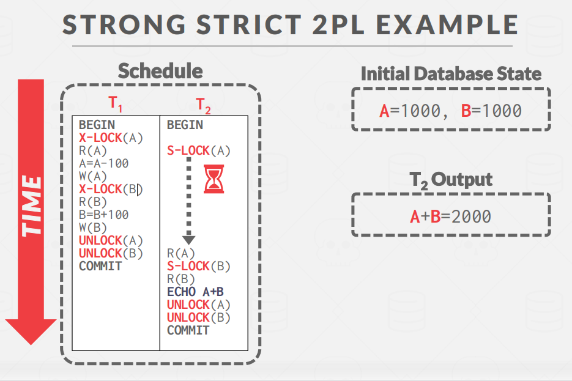

**Universe Of Schedules**

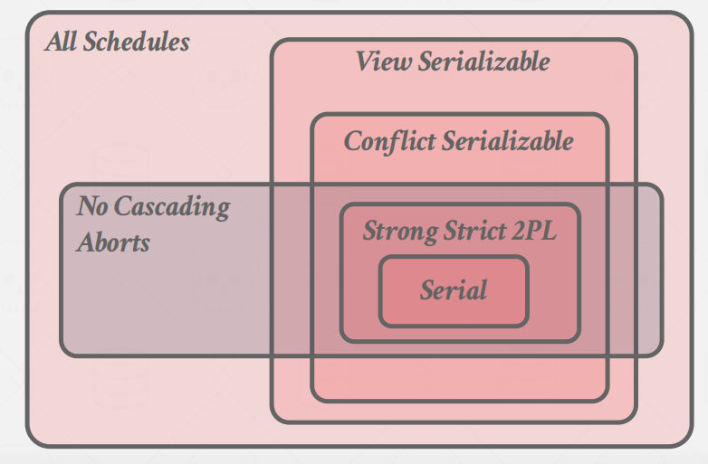

## Deadlock Detection + Prevention

但是有加锁，肯定就会有死锁的问题产生。

**2PL 无法避免的一个问题就是死锁**：

**例如**：

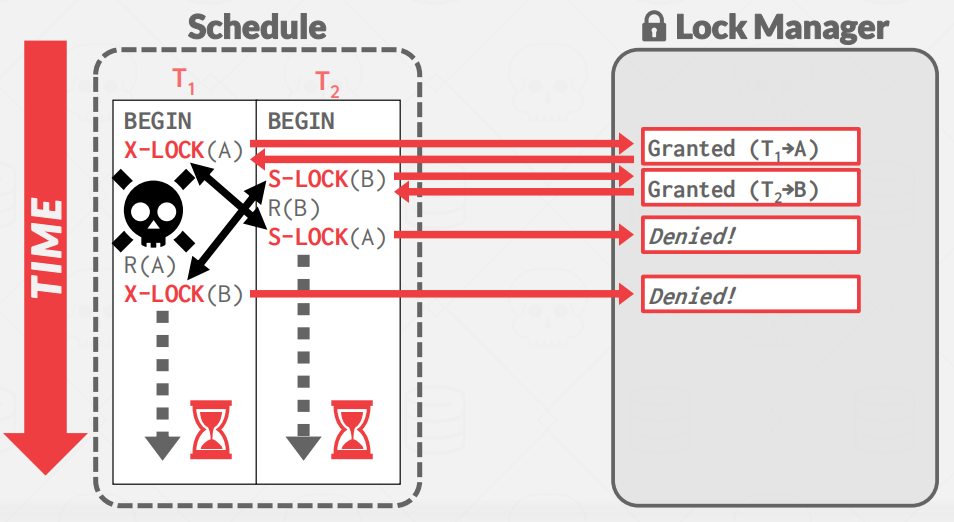

**死锁就是事务之间互相等待对方释放自己想要的锁**。

2种办法处理死锁：

1. **死锁检测**（事后的操作）
2. **死锁预防**（事先的操作）

### Deadlock Detection

DBMS创建一个等待图来跟踪每个txn等待获取的锁。

- 节点是事务
- 如果Ti等待Tj释放锁，那么就存在一条Ti到Tj的边

**系统定期检查等待图，然后决定如何打破它。**

**等待图的例子**：

**Deadlock Handling**

当DBMS检测到一个死锁时，它将选择一个“受害者的”txn进行回滚操作，以打破这个僵局。

受害者txn将**重新启动**或**中止**（更常见），这取决于它的调用方式。

有2个关键点：

1. 检测死锁的频率
2. 选择合适的 "受害者"

检测死锁的频率越高，陷入死锁的事务等待的时间越短，但消耗的 cpu 也就越多。所以这是个典型的 trade-off，通常有一个调优的参数供用户配置。

**选择 "受害者" 的指标**可能有很多：事务持续时间、事务的进度、事务锁住的数据数量、级联事务的数量、事务曾经重启的次数等等。在选择完 "受害者" 后，DBMS 还有一个设计决定需要做：完全回滚还是回滚到足够消除环形依赖即可（即**回滚的长度**，回滚到什么位置）。

### Deadlock Prevention

根据时间戳分配优先级

老的时间戳=具有更高的优先级（eg.T1>T2）

**Wait-Die ("Old Waits for Young")**

- 如果请求txn比持有锁的txn的优先级高，那么请求txn等待持有锁的txn。
- 否则请求txn自行中止。

**Wound-Wait ("Young Waits for Old")**

- 如果请求txn的优先级大于持有锁的txn，那么持有锁的txn将中止并释放锁。
- 否则请求txn等待。

**（简单说，年轻的吃亏）**

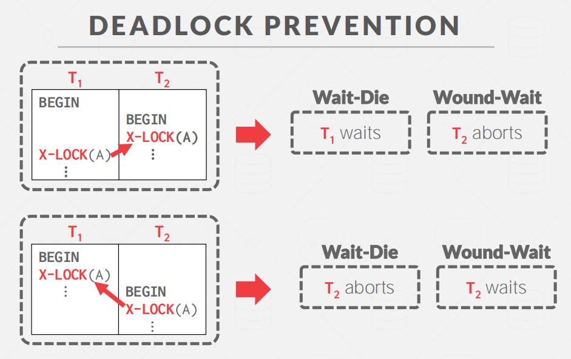

## Hierarchical Locking

接着上面的问题。

上面的例子中所有的锁都是针对单条数据 (database object)而言，如果一个事务需要更新十亿条数据，那么它就得请求10亿个锁，这个花销是巨大的。

因此，**需要对锁的粒度进行细分**。

当一个txn想要获得一个“锁”时，DBMS可以决定该锁的粒度（即范围）：Attribute? Tuple? Page? Table?

因此需要有一些手段能够将锁组织成树状/层级结构，**减少一个事务运行过程中需要记录的锁的数量。**

**intention lock**

参考资料：[意向锁(Intention Lock)](https://blog.csdn.net/qingmuluoyang/article/details/82378406)

**问题导入**：为什么会用到意向锁？

**解释**： 当我们向一张表加入表级锁的时候，这时候我们必须去表中每一行去遍历，看看对应的行是否已经用到对应的锁，这时候如果数据库中的数据海量的话，想要完成这个认为的难度就非常的大，难道没有一个好的方法？

意向锁在原有的锁(X锁和S锁)引入了新的锁(IX和IS)锁

1. **Intention-Shared (IS)**：这两个锁是表级别的锁，当需要对表中的某条记录上 S 锁的时候，先在表上加个 IS 锁，表明此时表内有 S 锁。
2. **Intention-Exclusive(IX)**：当需要对表中的某条记录上 X 锁的时候，先在表上加个 IX 锁，表明此时表内有 X 锁。
3. **Shared+Intention-Exclusive(SIX)**：

**兼容矩阵**

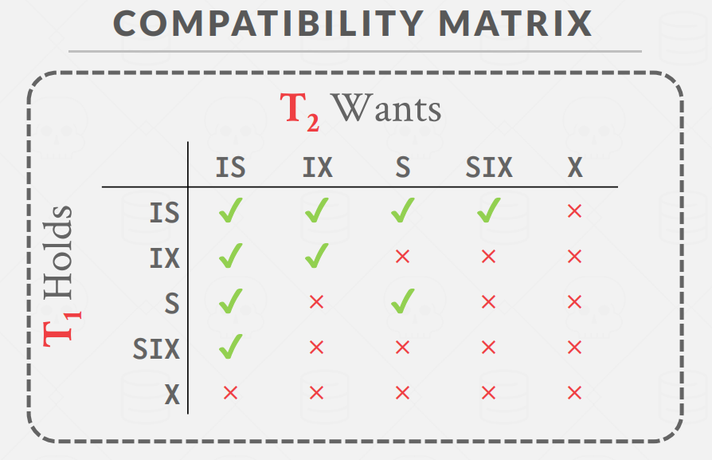