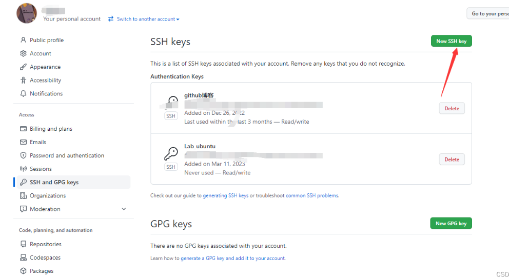
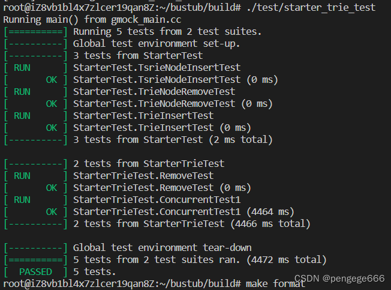
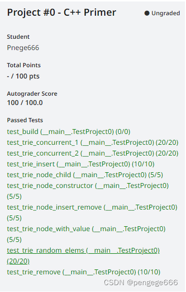

# CMU15-445：环境搭建+Project0

@[TOC]
**Lab网址**：https://15445.courses.cs.cmu.edu/fall2022/project0/

# 环境搭建
## 配置linux
笔者使用：~~ubuntu18.04+VWMare~~ （ubuntu20.4以上）

参考：[在vscode（win10）配置 CMU-15445-lab（linux子系统）](https://blog.csdn.net/Kprogram/article/details/124375883)

安装git
```bash
sudo apt install git
```
新建git账号
```bash
git config --global user.name "name"
git config --global user.email "YourEmail@qq.com"
```
生产密钥，遇到选项直接一路回车就行
```bash
ssh-keygen -t rsa -C "YourEmail@qq.com"
```
打开文件，复制密钥

```bash
 sudo cat ~/.ssh/id_rsa.pub
```

打开自己的github网站，找到Setting(点击头像找)，在下面位置添加密钥即可



测试连通性

`ssh -T git@github.com`

```bash
...
...
...
Hi X! You've successfully authenticated, but GitHub does not provide shell access.
```
> **简便的方法**

购买个腾讯云/阿里云的服务器。直接在上面跑~

## 配置Lab

```bash
sudo ./build_support/packages.sh
mkdir build
cd build
cmake ..
make
```
`bug1`：

```bash
bash: ./build_support/packages.sh: /bin/bash^M: bad interpreter: No such file or directory
```
由于复制的时候是doc格式，导致不好使。
```bash
:set ff #查看格式
：set ff=unix #设置格式
```
`bug2`：

```bash
bash: ./build_support/packages.sh: Permission denied
```

权限不够，需要给packages.sh单独赋予权限

```bash
chmod 777 packages.sh
```
`bug3`：

```bash
Package clang-14 is not available, but is referred to by another package.
This may mean that the package is missing, has been obsoleted, or
is only available from another source

E: Package 'clang-14' has no installation candidate
E: Unable to locate package clang-format-14
E: Unable to locate package clang-tidy-14
```

`bug4`：

在执行`sudo ./packages.sh`时，出现了找不到`clang-14`的问题。

```bash
E: Package 'clang-14' has no installation candidate
E: Unable to locate package clang-format-14
E: Unable to locate package clang-tidy-14
```

```bash
wget https://apt.llvm.org/llvm.sh
chmod +x llvm.sh
sudo ./llvm.sh 14
```

参考：[在Ubuntu上配置clang-14的环境](https://blog.csdn.net/weixin_50749380/article/details/128319851)

# Project01
## project
基础知识：

[智能指针 unique_ptr 详解](https://blog.csdn.net/fuhanghang/article/details/113928128?ops_request_misc=%257B%2522request%255Fid%2522%253A%2522167854001916782428639178%2522%252C%2522scm%2522%253A%252220140713.130102334.pc%255Fall.%2522%257D&request_id=167854001916782428639178&biz_id=0&utm_medium=distribute.pc_search_result.none-task-blog-2~all~first_rank_ecpm_v1~hot_rank-2-113928128-null-null.142^v73^control,201^v4^add_ask,239^v2^insert_chatgpt&utm_term=%E6%99%BA%E8%83%BD%E6%8C%87%E9%92%88unique_ptr&spm=1018.2226.3001.4187)
[C++11——右值引用](https://blog.csdn.net/weixin_57023347/article/details/120957689)
[C++ move()函数](https://blog.csdn.net/chengjian168/article/details/107809308?ops_request_misc=%257B%2522request%255Fid%2522%253A%2522167861181716800186590327%2522%252C%2522scm%2522%253A%252220140713.130102334.pc%255Fall.%2522%257D&request_id=167861181716800186590327&biz_id=0&utm_medium=distribute.pc_search_result.none-task-blog-2~all~first_rank_ecpm_v1~hot_rank-4-107809308-null-null.142^v73^insert_down1,201^v4^add_ask,239^v2^insert_chatgpt&utm_term=C%2B%2Bmove&spm=1018.2226.3001.4187)
[【C++】C++11语法之右值引用](https://blog.csdn.net/weixin_52344401/article/details/123565675?ops_request_misc=%257B%2522request%255Fid%2522%253A%2522167860999016800211544196%2522%252C%2522scm%2522%253A%252220140713.130102334.pc%255Fall.%2522%257D&request_id=167860999016800211544196&biz_id=0&utm_medium=distribute.pc_search_result.none-task-blog-2~all~first_rank_ecpm_v1~hot_rank-2-123565675-null-null.142^v73^insert_down1,201^v4^add_ask,239^v2^insert_chatgpt&utm_term=%E5%8F%B3%E5%80%BC%E5%BC%95%E7%94%A8&spm=1018.2226.3001.4187)
...
题目的内容就多读几遍文档。
## 本地测试

```bash
$ cd build
$ make starter_trie_test
$ ./test/starter_trie_test
```




下方问题参考：[2021.08.11 CMU DB 15-445: [Project1] buffer pool](https://blog.csdn.net/one_chow_chow/article/details/119609514)

```bash
root@iZ8vb1bl4x7zlcer19qan8Z:~/bustub/build# make format
make[3]: ../build_support/run_clang_format.py: Permission denied
make[3]: *** [CMakeFiles/format.dir/build.make:70: CMakeFiles/format] Error 127
make[2]: *** [CMakeFiles/Makefile2:863: CMakeFiles/format.dir/all] Error 2
make[1]: *** [CMakeFiles/Makefile2:870: CMakeFiles/format.dir/rule] Error 2
make: *** [Makefile:199: format] Error 2
root@iZ8vb1bl4x7zlcer19qan8Z:~/bustub/build# sudo make format
make[3]: ../build_support/run_clang_format.py: Permission denied
make[3]: *** [CMakeFiles/format.dir/build.make:70: CMakeFiles/format] Error 127
make[2]: *** [CMakeFiles/Makefile2:863: CMakeFiles/format.dir/all] Error 2
make[1]: *** [CMakeFiles/Makefile2:870: CMakeFiles/format.dir/rule] Error 2
make: *** [Makefile:199: format] Error 2
root@iZ8vb1bl4x7zlcer19qan8Z:~/bustub/build# chmod u+rwx ../build_support/run_clang_format.py
root@iZ8vb1bl4x7zlcer19qan8Z:~/bustub/build# sudo make format
/usr/bin/env: ‘python3\r’: No such file or directory
make[3]: *** [CMakeFiles/format.dir/build.make:70: CMakeFiles/format] Error 127
make[2]: *** [CMakeFiles/Makefile2:863: CMakeFiles/format.dir/all] Error 2
make[1]: *** [CMakeFiles/Makefile2:870: CMakeFiles/format.dir/rule] Error 2
make: *** [Makefile:199: format] Error 2
root@iZ8vb1bl4x7zlcer19qan8Z:~/bustub/build# python
Command 'python' not found, did you mean:
  command 'python3' from deb python3
  command 'python' from deb python-is-python3
```
记载bug：`/usr/bin/env: ‘python3\r’: No such file or directory`

解决方法：遇到这种Bug，vim打开要跑的文件
1. `: set ff `查看

2. 然后`:set ff=unix`修改成`unix`类型。

3. 然后`:wq`保存退出即可

## 在线测试
网址：https://www.gradescope.com/


邀请码：PXWVR5

学校：Carnegie Mellon University

然后在邮箱上确定填写密码就可以啦~



在线测试注意点：

- 一定要现在本地测试一遍再提交
	

```bash
$ cd build
$ make starter_trie_test
$ ./test/starter_trie_test
```

```bash
$ make format
$ make check-lint
$ make check-clang-tidy-p0
```

- 注意文件格式，`utf-8格式`。要不然会报错。


学习参考资料：
- https://15445.courses.cs.cmu.edu/fall2022/faq.html#q8
- https://blog.csdn.net/antio2/category_12101097.html
- https://blog.csdn.net/AntiO2/article/details/127796786
- https://blog.eleven.wiki/

