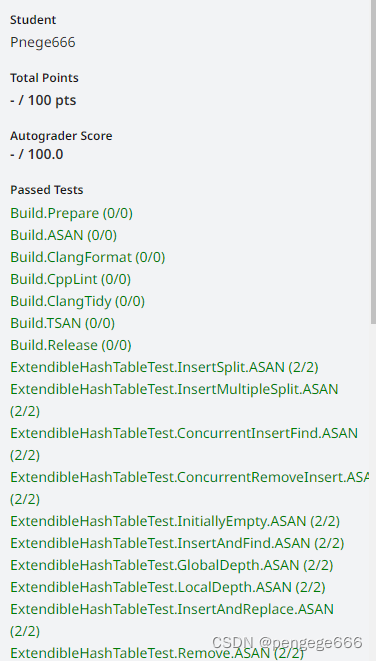
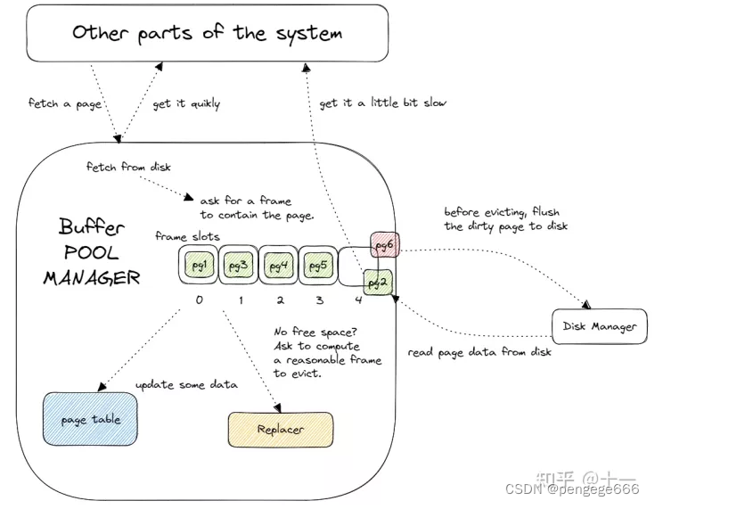
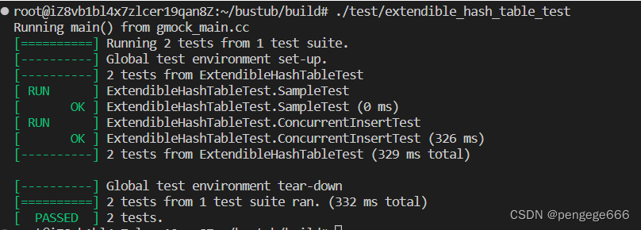
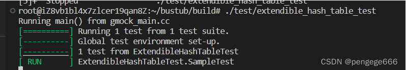
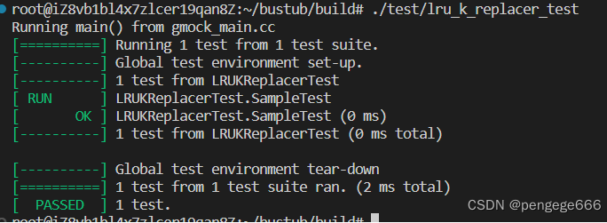
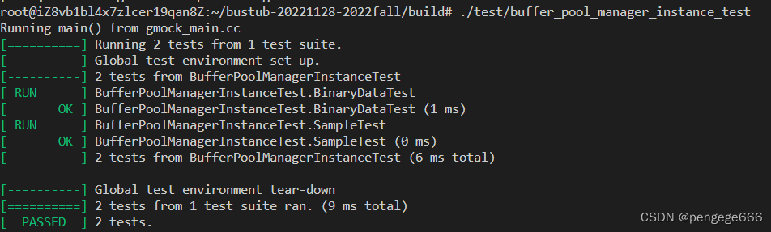

@[TOC]
# Project1

**Lab网址**：https://15445.courses.cs.cmu.edu/fall2022/project1/

**整体流程**

 图片取自：[做个数据库：2022 CMU15-445 Project1 Buffer Pool Manager
](https://zhuanlan.zhihu.com/p/571927310)

## Task1
**运行截图**

**实现思路**

Task1是实现一个可扩展哈希表，用于存储`<frame_id,page_id>`。

可扩展哈希表由多个目录项和桶组成。
- 目录项`dir_`：用于存放桶的地址
- 桶`bucket`：用于存放每个`<K,V>`(也就是`<frame_id,page_id>`)

具体的实现思路见这篇文章：[动态hash方法（数据库索引技术）](https://www.cnblogs.com/kegeyang/archive/2012/04/05/2432608.html)

这里说一下比较繁琐的插入操作吧：

首先，我们要先通过`IndexOf`确定出`key`要插入的目录的位置，然后再判断这个位置上的桶是否为空，如果该位置上的桶是空的话，就可以直接插入。如果该位置上的桶已经满了，那么就要判断是否需要增加目录项（通过全局位深度和桶的局部位深度进行判断），如果需要增加目录项，先对桶进行扩容。然后再对桶进行分裂操作。根据异或的值（在代码中有更好的方式实现），对原先桶中的值重排。最后插入新增的键值对。（注意：project说明中只要进行扩容即可）

**参考资料**
- https://blog.eleven.wiki/
-  [《数据库系统概念》15-可扩展动态散列
](https://cloud.tencent.com/developer/article/1020586)
- [基于LRU-K算法设计本地缓存实现流量削峰](https://blog.csdn.net/love254443233/article/details/82598381)
- [2022 CMU15-445 Project 1 Buffer Pool](https://blog.csdn.net/q2453303961/article/details/128153709)
- https://www.cnblogs.com/JayL-zxl/p/14324297.html

**bug**:

有锁函数调用有锁函数

## Task2
**运行截图**

**实现思路**

这个部分的功能主要是利用`LRU-K`算法选择掉缓冲区中的`page`替换出去。

这个部分实现比较简单，主要可以先看这个视频：[【C++数据库内核】CMU15-445/645实验项目Project 1【LRU-K替换策略】](https://www.bilibili.com/video/BV1xe411T77B/?spm_id_from=333.337.search-card.all.click&vd_source=d6efee335659a376be8deb6c0654e9f7)或者先根据测试样例学习。

笔者这里是维护2个list。暴力进行模拟实现的。性能方面还有待提升。

**参考资料**

- [缓存替换策略：LRU-K算法详解及其C++实现 CMU15-445 Project#1
](https://blog.csdn.net/AntiO2/article/details/128439155?ops_request_misc=%257B%2522request%255Fid%2522%253A%2522167903942016800192299919%2522%252C%2522scm%2522%253A%252220140713.130102334..%2522%257D&request_id=167903942016800192299919&biz_id=0&utm_medium=distribute.pc_search_result.none-task-blog-2~all~top_positive~default-1-128439155-null-null.142^v74^insert_down1,201^v4^add_ask,239^v2^insert_chatgpt&utm_term=LRU-K&spm=1018.2226.3001.4187)

- [CMU 15-445 (FALL 2022) Project #1 Buffer Pool题解
](https://blog.csdn.net/AntiO2/article/details/128554356)

- [【C++数据库内核】CMU15-445/645实验项目Project 1【LRU-K替换策略】](https://www.bilibili.com/video/BV1xe411T77B/?spm_id_from=333.337.search-card.all.click&vd_source=d6efee335659a376be8deb6c0654e9f7)

## Task3
**运行截图**

**实现思路**

这个部分的功能是实现缓冲区页面的管理，与task1和task2很好的建立联系。

重要变量的含义
- pages：buffer pool 中缓存 pages 的指针数组
- disk_manager：框架提供，可以用来读取 disk 上指定 page id 的 page 数据，或者向 disk 上给定 page id 对应的 page 里写入数据
- page_table：刚才实现的 Extendible Hash Table，用来将 page id 映射到 frame id，即 page 在 buffer pool 中的位置
- replacer：刚才实现的 LRU-K Replacer，在需要驱逐 page 腾出空间时，告诉我们应该驱逐哪个 page
- free_list：空闲的 frame 列表

函数含义
- `NewPgImp(page_id_t *page_id) -> Page * `：
	- 功能：在缓冲区中创建一个新页面，并返回其地址。
	- 思路：首先判断是否缓冲区中的页面都不可以驱逐。如果都不可以驱逐的话就返回`nullptr`。否则，一定可以创建出新页面。我们应该先去`free_list`中查找是否有空闲的frame。如果存在，调用`AllocatePage()`放入。（Note：需要同时更新LRU和ExtendibleHashTable）。如果不存在，用LRU算法驱逐出一个frame，然后放入。（Note：此处的注意不单单包含存在时候的注意，同时要判断该页面是不是脏页面，是脏页就得读到Disk去）。剩下的细节部分看头文件中的说明。
- `BufferPoolManagerInstance::FetchPgImp(page_id_t page_id) -> Page *`:
	- 功能：从缓冲区中拿取指定的页面。
	- 思路：首先，先判断是否缓冲区中已经存在该页面，存在即直接返回。若不存在，则和`NewPgImp`思路一致。（Note：因为这个函数拿取的包括数据，需要调用`ReadPage()`拿取数据）。
	- 对比：该函数和`NewPgImp`刚开容易混肴，但是我的理解是`NewPgImp`是开始的时候给缓冲区建立的关系。而这个函数是在实际中进行使用。
- `UnpinPgImp(page_id_t page_id, bool is_dirty) -> bool`
  - 功能：unpin指定页面。
  - 思路：如果页面不在缓冲区或者`pin_count`本来就为`0`，则直接返回`false`。否则将`pin_count--`,当为0时，意味的LRU可以将其驱逐，进行驱逐标记的设置。（Note:脏页标记的设置）

- `FlushPgImp(page_id_t page_id) -> bool`
	 - 功能：刷回磁盘,将数据写进磁盘
 - `DeletePgImp(page_id_t page_id) -> bool`
 	- 功能：删除指定的页面 

**参考资料**
- [做个数据库：2022 CMU15-445 Project1 Buffer Pool Manager](https://zhuanlan.zhihu.com/p/571927310)
- [CMU 15-445 (FALL 2022) Project #1 Buffer Pool题解
](https://blog.csdn.net/AntiO2/article/details/128554356)

使用工具：AddressSanitizer

bug：
1. ExtendibleHashTable.cpp中insert的`while`
2. bufferPoolManger_instance.cpp中`FetchPgImp`在哈希表中直接找到时候未对`pin++`以及调用`LRU`算法
3. bufferPoolManger_instance.cpp中`FetchPgImp`漏写将数据从Disk中取出语句：`disk_manager_->ReadPage`