@[TOC]
# Project2
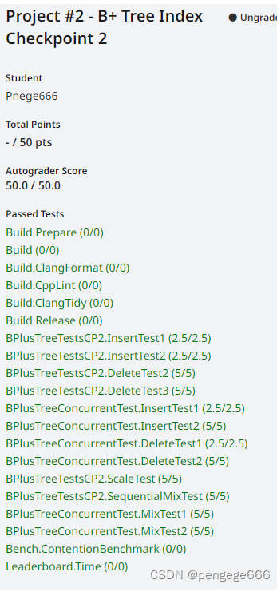

## Task1(insert)

B+树伪代码看《Database System Concepts》。project中是按照书本上的伪代码实现的。
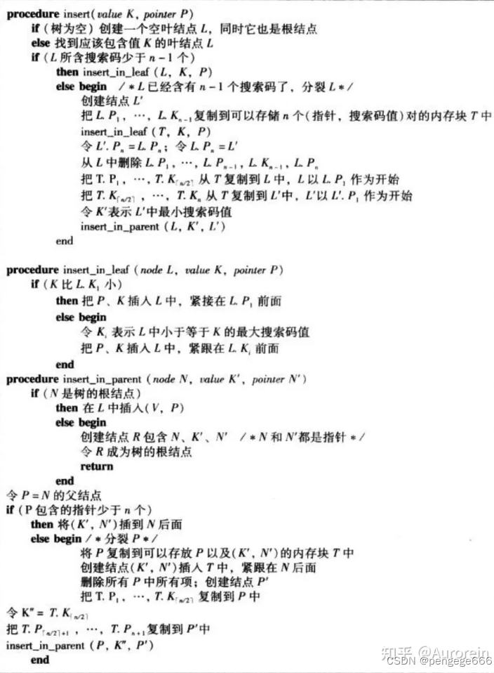
 图片取自： [CMU 15-445 B_Plus_Tree Index Lab Task 1-2](https://zhuanlan.zhihu.com/p/615910266)

```cpp
root：如果是LeafNode，最多N-1，最少1；如果是InternalNode，最多N，最少2
leaf：[N/2,N-1]，前者是向下取整
internal：最多N，最少「N/2」（即除2向上取整）注意：内点的N是孩子的数量
```

project2介绍中提到

```bash
You should correctly perform splits if insertion triggers the splitting condition 
(number of key/value pairs AFTER insertion equals to max_size for leaf nodes, 
number of children BEFORE insertion equals to max_size for internal nodes).
```


参考资料：

-  [CMU15-445 Project2 B+Tree Index](https://blog.eleven.wiki/posts/cmu15-445-project2-b+tree-index/#checkpoint1-single-thread-btree)
- [[已满分在线评测] cmu15445 2022 PROJECT #2 B+Tree Index](https://www.cnblogs.com/alyjay/p/16885958.html)
- [聚簇索引与非聚簇索引（也叫二级索引）--最清楚的一篇讲解
](https://cloud.tencent.com/developer/article/1541265)
- [B+树详解+代码实现（插入篇） ](https://www.cnblogs.com/JayL-zxl/p/14304178.html)
- [B树和B+树的插入、删除图文详解 ](https://www.cnblogs.com/nullzx/p/8729425.html)
- [课程可视化网站](https://bustub.skyzh.dev/bpt-printer/)
- [CMU 15445 Project 2A 实现并发B+树的数据库索引（查询和插入）
](https://www.jianshu.com/p/628a39d03b79)
- [CMU 15445 Project 2C 实现B+树并发INDEX
](https://www.jianshu.com/p/b83272f7684b)
- 这是2020的仓库，其中B+树给提示了：[2020版本](https://github1s.com/nefu-ljw/database-cmu15445-fall2020/blob/a8aac5abf64f5a61ca08f59e57e2d8f962692b32/src/storage/page/b_plus_tree_leaf_page.cpp)
- [CMU 15-445 Project 2 B+ Tree 技术总结
](https://blog.csdn.net/u010180372/article/details/122095553)
- [Project #2 - B+Tree CHECKPOINT #2](https://zhuanlan.zhihu.com/p/602088979)
- [CMU 15-445实验记录（三）：Project 2 B+Tree的插入与删除
](https://blog.csdn.net/qq_45698833/article/details/121284841)
- [《CMU15445》 && [B+Tree]](https://zhuanlan.zhihu.com/p/408766723)

参考代码：
- https://github1s.com/seahorseZhang/CMU15445-2022fall/
- https://github1s.com/nefu-ljw/database-cmu15445-fall2020/
- https://github1s.com/yixuaz/CMU-15445/

- [2020B+树代码函数](https://github1s.com/nefu-ljw/database-cmu15445-fall2020/blob/b965b8306896d70e0511e4306d440d7cb888ccc9/src/include/storage/page/b_plus_tree_internal_page.h)


写了一周的B+树`insert`,QAQ。真难啊。ps:本地通过了，不知道线上错多少.简单截图做个记录吧 [2023.3.26]

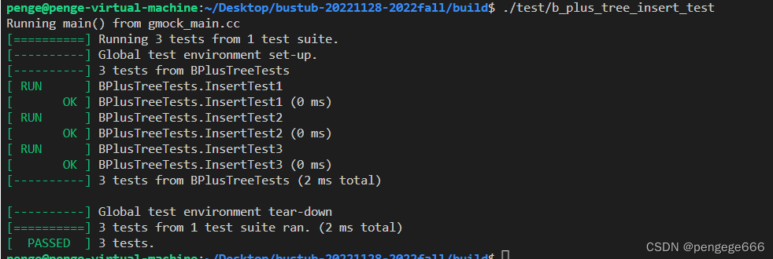
## Task2(delete)
- http://courses.cms.caltech.edu/cs122/lectures-wi2018/CS122Lec11.pdf
- [CMU 15-445 B_Plus_Tree Index Lab Task 1-2](https://zhuanlan.zhihu.com/p/615910266)

 **删除算法整体流程**

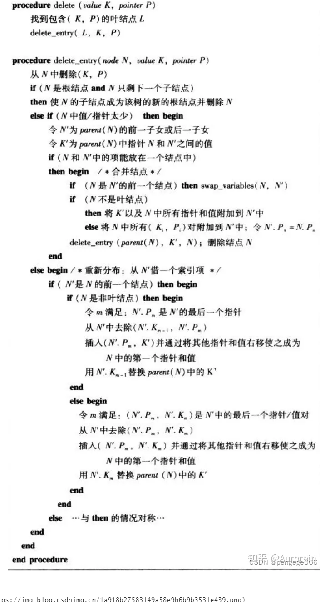


> **case1:内节点的合并**

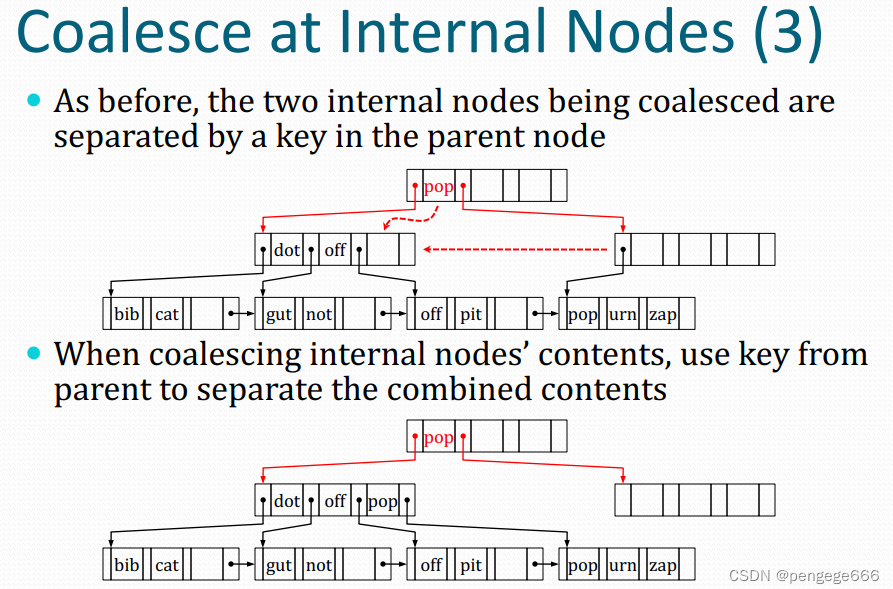
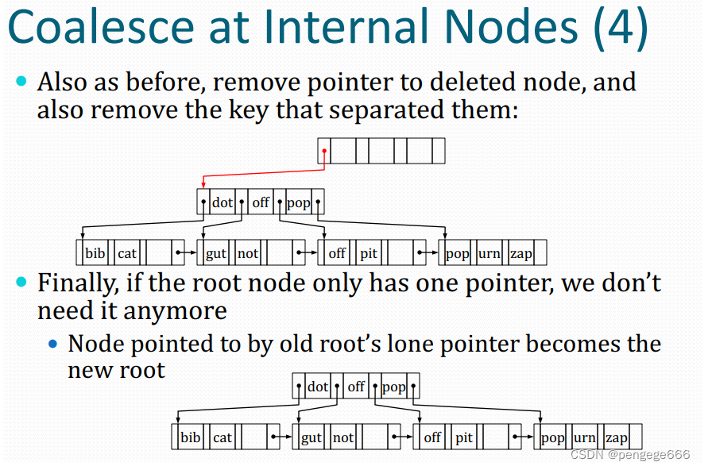

> **case2:叶子节点合并**

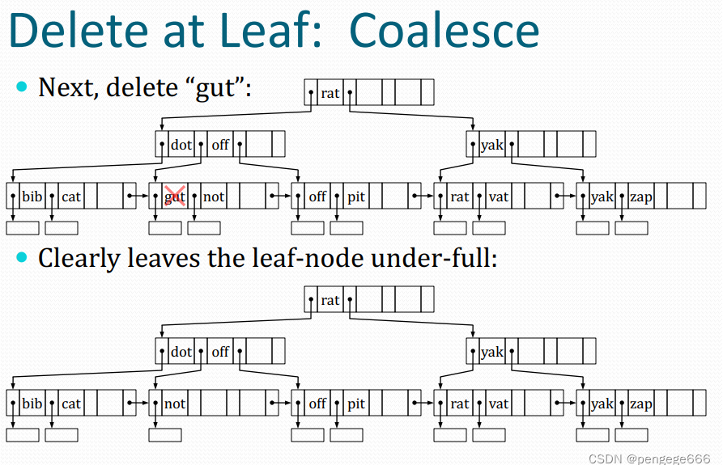
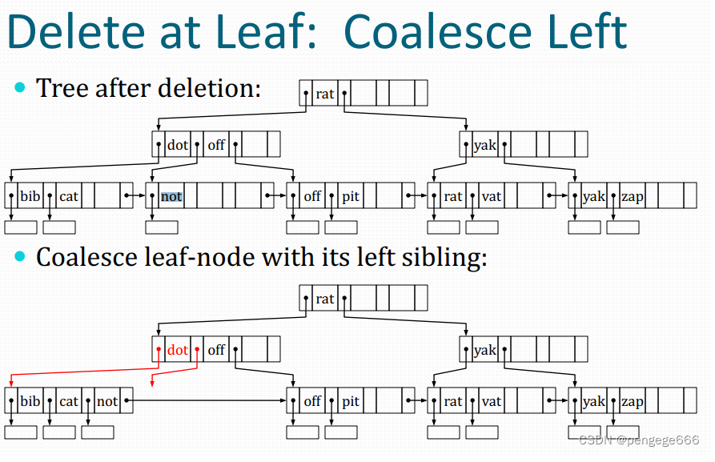

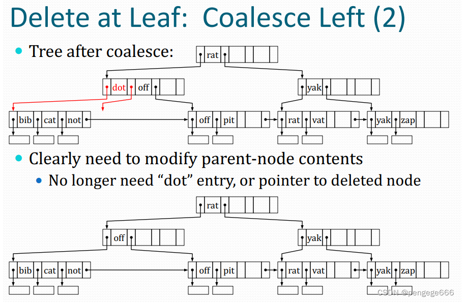
> **case3:叶节点重分配**

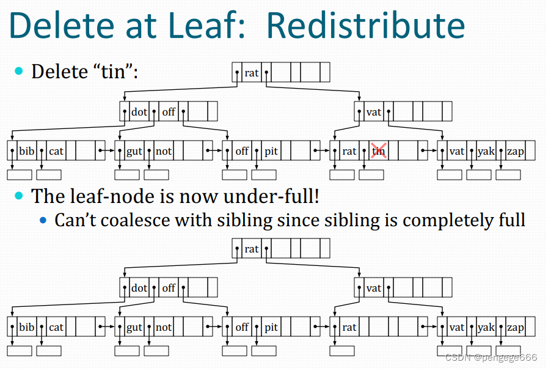

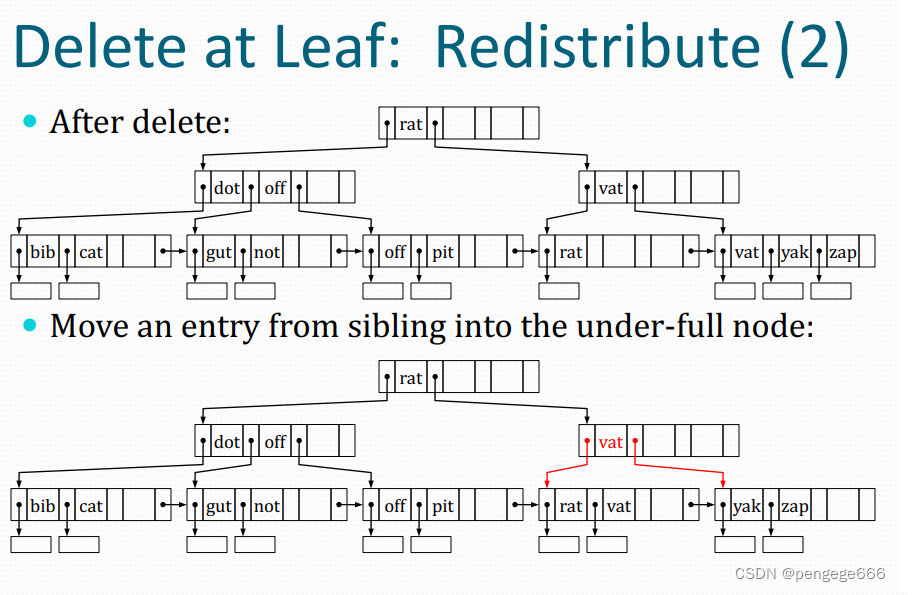


> **case4:内节点重分配**

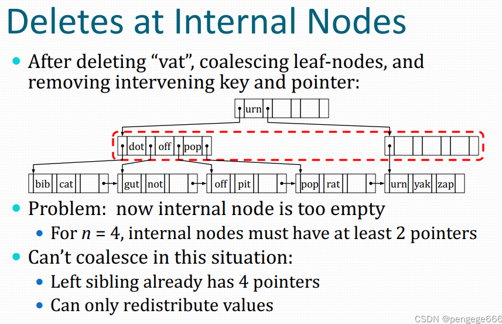
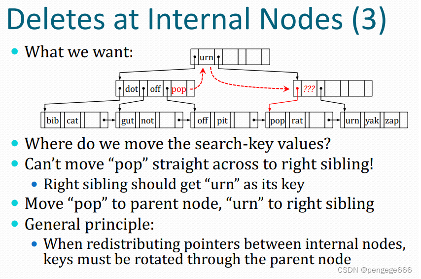
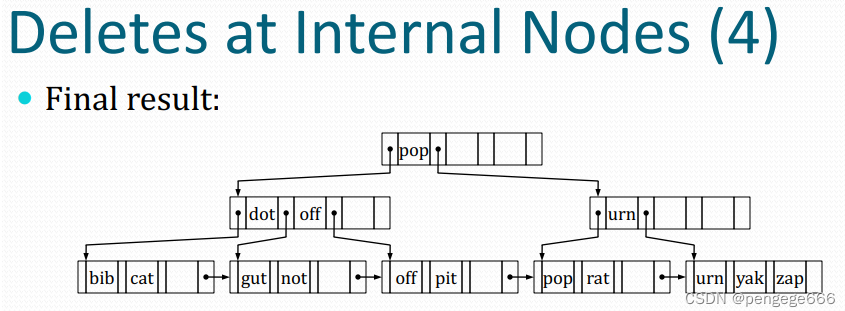

## Task3(index)


 - [CMU15-445 Lab2 B+Tree全记录](https://www.cnblogs.com/sun-lingyu/p/15198683.html)

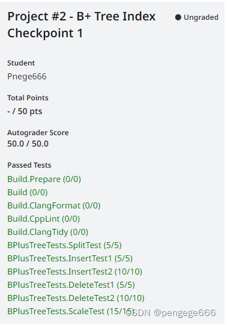
## Task4(Concurrent Index)

参考资料：
- [CMU 15445-2022 P2 B+Tree Concurrent Control
](https://zhuanlan.zhihu.com/p/593214033?)
- [MySQL · 引擎特性 · B+树并发控制机制的前世今生](http://mysql.taobao.org/monthly/2018/09/01/)
- [CMU15-445 Project2 B+Tree Index](https://blog.eleven.wiki/posts/cmu15-445-project2-b+tree-index/#task1-btree-pages)
- [CMU 15445 Project 2C 实现B+树并发INDEX](https://www.jianshu.com/u/38eb16b24cb9)
- [CMU15-445 Lab2 B+Tree全记录](https://www.cnblogs.com/sun-lingyu/p/15198683.html)
- [CMU15445 2020 B+TREE简单记录](https://blog.csdn.net/freedom1523646952/article/details/126625890?ops_request_misc=%257B%2522request%255Fid%2522%253A%2522168061186216800197028902%2522%252C%2522scm%2522%253A%252220140713.130102334..%2522%257D&request_id=168061186216800197028902&biz_id=0&utm_medium=distribute.pc_search_result.none-task-blog-2~all~baidu_landing_v2~default-1-126625890-null-null.142^v81^control,201^v4^add_ask,239^v2^insert_chatgpt&utm_term=cmu15445%20B%2B&spm=1018.2226.3001.4187)

代码学习

- [代码1](https://github1s.com/Yiyuan-Dong/bustub2020/blob/HEAD/src/include/storage/index/generic_key.h)
- [代码2](https://github1s.com/hit-lance/bustub/blob/HEAD/src/storage/index/b_plus_tree.cpp)
-  [代码3](https://github1s.com/hit-lance/bustub/blob/2a51165921af53fd9391dd663e06888b37d92342/src/storage/index/b_plus_tree.cpp)

锁的知识点：

- [C++11：互斥锁std::mutex和std::lock_guard/std::unique_lock](https://blog.csdn.net/aiynmimi/article/details/127492406?ops_request_misc=%257B%2522request%255Fid%2522%253A%2522168092006916800182774955%2522%252C%2522scm%2522%253A%252220140713.130102334.pc%255Fall.%2522%257D&request_id=168092006916800182774955&biz_id=0&utm_medium=distribute.pc_search_result.none-task-blog-2~all~first_rank_ecpm_v1~rank_v31_ecpm-1-127492406-null-null.142^v82^control,201^v4^add_ask,239^v2^insert_chatgpt&utm_term=std%3A%3Aunique_lock%3Cmutex_t%3E%20latch%28mutex_%29%3B&spm=1018.2226.3001.4187)