# Concurrency-Control-Theory

参考资料：

- [Concurrency Control Theory](https://zhenghe.gitbook.io/open-courses/cmu-15-445-645-database-systems/concurrency-control-theory)
- [CMU15445 Concurrency Control Theory笔记](https://zhuanlan.zhihu.com/p/563646516)

## Preface

在前面的课程中介绍了 DBMS 的主要模块及架构，自底向上依次是 Disk Manager、Buffer Pool Manager、Access Methods、Operator Execution 及 Query Planning。但数据库要解决的问题并不仅仅停留在功能的实现上，它还需要具备：

- 满足多个用户同时读写数据，即 **Concurrency Control**，如：

  -  两个用户同时写入同一条记录

- 面对故障，如宕机，能恢复到之前的状态，即 **Recovery**，如：

  - 你在银行系统转账时，转到一半忽然停电

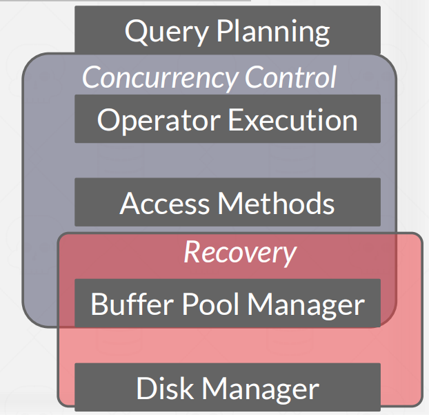

**Concurrency Control 与 Recovery 都是 DBMSs 的重要特性**，它们渗透在 DBMS 的每个主要模块中。而**二者的基础都是具备 ACID 特性的 Transactions**。本节讨论Transactions。

## Transactions

**定义**：Transactions是在数据库上执行一个或多个操作的序列（例如，SQL查询），以及执行一些更高级别的函数。

**特点**：Transactions是DBMS中状态变化的基本单位，一个事务要不全都执行，要不全都不执行。

**例子**：

从 A 账户转账 100 元至 B 账户

```bash
检查 A 的账户余额是否超过 100 元
从 A 账户中扣除 100 元
往 B 账户中增加 100 元
```

## Strawman/Simple System

假设系统中只存在一个线程负责执行 transaction：

- 任何时刻只能有一个 transaction 被执行且每个 transaction 开始执行就必须执行完毕才轮到下一个。
- 在**事务(txn)**启动之前，请将整个数据库复制到一个新文件中，并对该文件进行所有更改。
  -  如果txn成功完成，请用新文件覆盖原始文件。
  - 如果txn失败，只需删除脏副本。

**缺点**：无法利用多核计算能力并行地执行相互独立的多个 transactions，从而提高 CPU 利用率、吞吐量，减少用户的响应时间，但其难度也是显而易见的，获得种种好处的同时必须保证数据库的正确性和 transactions 之间的公平性。 显然我们无法让 transactions 的执行过程在时间线上任意重叠，因为这可能导致数据的永久不一致。于是我们需要一套标准来定义数据的正确性。

## Formal Definitions

**Database**: A fixed set of named data objects (e.g., A, B, C, ...) 

**Transaction**: A sequence of read and write operations (e.g., R(A), W(B), ...)【R(A)：对A读操作，W(B)：对B写操作】

**SQL事务的使用**：

- 事务txn以**BEGIN**命令开始提交
- 事务txn在**COMMIT**或**ABORT**时停止
  - 如果**COMMIT**，DBMS要么保存所有txn的更改
  - 如果**ABORT**，所有更改都被撤消，这样就像txn从未执行过一样
- **Abort**可有程序员或者DBMS执行

**transaction的正确性标准（ACID）：**

- Atomicity："all or nothing"
- Consistency: "it looks correct to me"
- Isolation: "as if alone"
- Durability: "survive failures"

## Atomicity

Transaction 执行只有两种结果：

- 全部执行
- 不执行，跟没执行前一样

**Pro:**

1. 我们从安迪的账户中取出了100美元，但是随后DBMS在我们转移它之前放弃了txn。
2. 我们从安迪的账户里取了100美元，但在我们转账之前停电了。

**解决方案1-Logging**

- DBMS**记录所有操作（写日志）**，以便它可以撤消已中止的事务的操作。
- 在内存和磁盘上维护撤消记录

**解决方案2- Shadow Paging**

- DBMS会生成页面的副本，而txns会对这些副本进行更改。只有当txn提交时，页面才会对其他人可见。（即，**复制修改的page**）

## Consistency

**数据库一致性（Database Consistency）是指事务执行的结果必须是使数据库从一个一致性状态变到另一个一致性状态**。保证数据库一致性是指当事务完成时，必须使所有数据都具有一致的状态。在关系型数据库中，所有的规则必须应用到事务的修改上，以便维护所有数据的完整性。

## Isolation

用户提交 transactions，**不同 transactions 执行过程应当互相隔离，互不影响**，**每个 transaction 都认为只有自己在执行**。但对于 DBMS 来说，为了提高各方面性能，需要恰如其分地向不同的 transactions 分配计算资源，使得执行又快又正确。这里的 “恰如其分” 的定义用行话来说，就是 **concurrency control protocol，即 DBMS 如何认定多个 transactions 的重叠执行方式是正确的**。有两种 protocols

- **Pessimistic：**不让问题出现，将问题扼杀在摇篮之中
- **Optimistic：**感觉问题不大，出现了再处理。

**例子**：

假设 A, B 账户各有 1000 元，当下有两个 transactions：

- T1：从 A 账户转账 100 元到 B 账户
- T2：给 A、B 账户存款增加 6% 的利息

```bash
// T1
BEGIN
A = A - 100
B = B + 100
COMMIT
// T2
BEGIN
A = A * 1.06
B = B * 1.06
COMMIT
```

那么 T1、T2 发生后，可能的合理结果应该是怎样的？

可能的结果有很多种，但是总和不变，A + B 的和应为 2000 * 1.06 = 2120 元。DBMS 无需保证 T1 与 T2 执行的先后顺序，如果二者同时被提交，那么谁先被执行都是有可能的，但执行后的净结果应当与二者按任意顺序分别执行的结果一致，

- A=954, B=1166 -> **A+B=$2120**
- A=960, B=1160 -> **A+B=$2120**

这和执行的顺序有关，如下图所示。

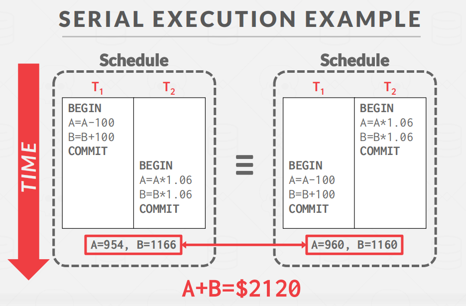

当一个 transaction 在等待资源 (page fault、disk/network I/O) 时，或者当 CPU 存在其它空闲的 Core 时，其它 transaction 可以继续执行，因此**我们需要将 transactions 的执行重叠 (interleave)** 起来。

**GOOD**

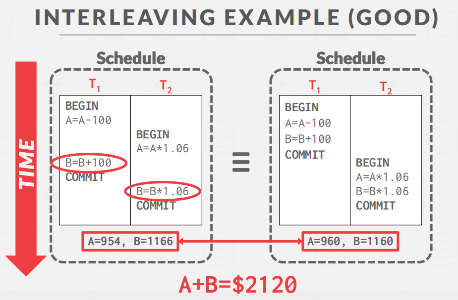

**BAD**

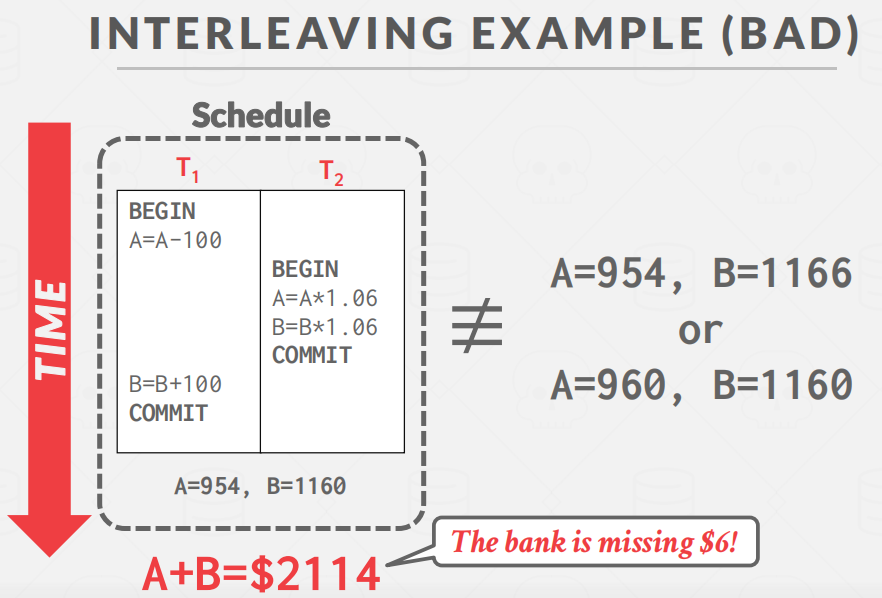

我们从DBMS角度分析问题，将操作简化成R和W。


**❓Think**：**How do we judge whether a schedule is correct?**

> **FORMAL PROPERTIES OF SCHEDULES**

**If the schedule is equivalent to some serial execution**

**3个概念**：

- Serial Schedule: 不同 transactions 之间没有重叠
  - 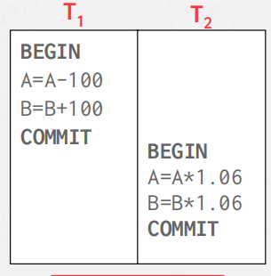
- Equivalent Schedules: 对于任意数据库起始状态，若两个 schedules 分别执行所到达的数据库最终状态相同，则称这两个 schedules 等价
- Serializable Schedule: 如果一个 schedule 与 transactions 之间的某种 serial execution 的效果一致，则称该 schedule 为 serializable schedule。（我的理解：隐式的Serial Schedule）

> **Conflicting Operations**

在对 schedules 作等价分析前，需要了解 conflicting operations。当两个 operations 满足以下条件时，我们认为它们是 conflicting operations：

- 来自不同的 transactions

- 对同一个对象操作

- 两个 operations 至少有一个是 write 操作

有以下3种情况：

- Read-Write Conflicts (R-W)
- Write-Read Conflicts (W-R)
- Write-Write Conflicts (W-W)

**Read-Write Conflicts (R-W)**

**Unrepeatable Read：**当多次读取同一对象时，Txn得到不同的值。

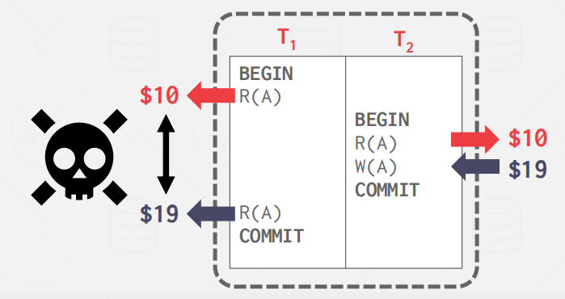

**Write-Read Conflicts (W-R)**

**Dirty Read：**一个txn读取由另一个尚未提交的txn写入的数据。

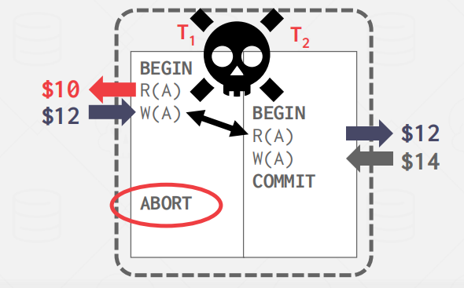

**Write-Write Conflicts (W-W)**

**Lost Update:** 一个txn从另一个未提交的txn中覆盖未提交的数据


从以上例子可以理解 serializability 对一个 schedule 意味着这个 schedule 是否正确。serializability 有两个不同的级别：

- Conflict Serializability (Most DBMSs try to support this)：
  - 两个 schedules 在 transactions 中有相同的 actions，且每组 conflicting actions 按照相同顺序排列，则称它们为 conflict equivalent
  - 一个 schedule  S 如果与某个 serial schedule 是 conflict equivalent，则称 S 是 conflict serializable
  - 如果通过交换不同 transactions 中连续的 non-conflicting operations 可以将 S 转化成 serial schedule，则称 S 是 conflict serializable
- View Serializability (No DBMS can do this)（通过肉眼观察）

例 1：将 conflict serializable schedule S 转化为 serial schedule

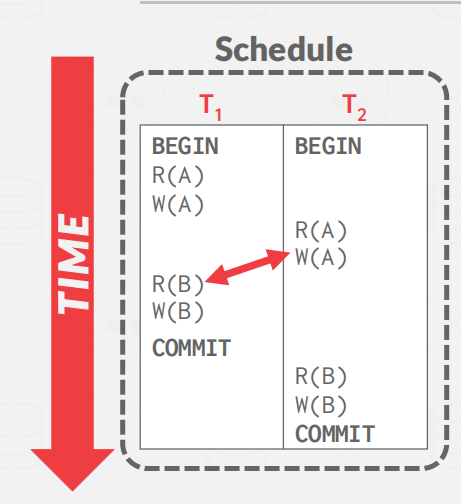

通过交换得到


例 2：S 无法转化成 serial schedule

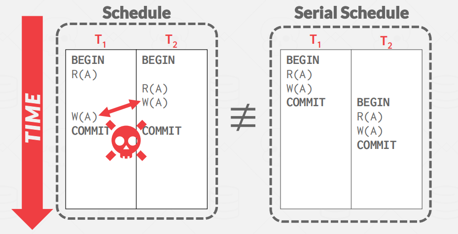

由于两个 W(A) 之间是矛盾的，无法交换，因此 S 无法转化成 serial schedule。

**Dependency graphs**

上文所述的交换法在**检测两个 transactions 构成的 schedule 很容易**，但要检测多个 transactions 构成的 schedule 是否 serializable 则显得别扭。

dependency graphs：每一个txn对应一个node，如果一个事务中的某个操作与其他事务中的另一个操作产生冲突，那么这两个事务之间就会有一条线。

如果一个dependency graph中存在环，那么这个schedule就是conflict serializable。


**View Serializability**

直接来看例子，下面例子通过构图的形式发现存在conflict，但是其实我们分析每个事务发现，这个Schedule就是重写A的值。

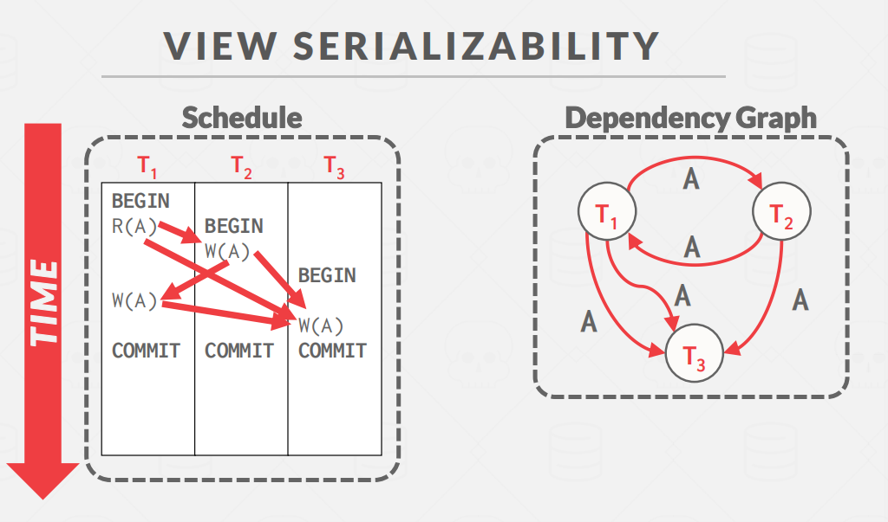

因此可以改写成这样

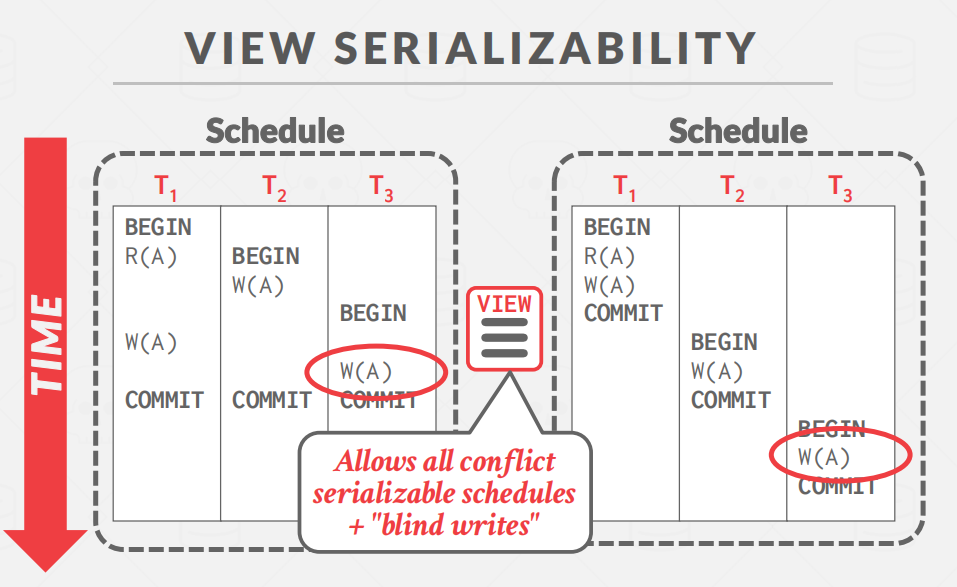

**universe of schedules**

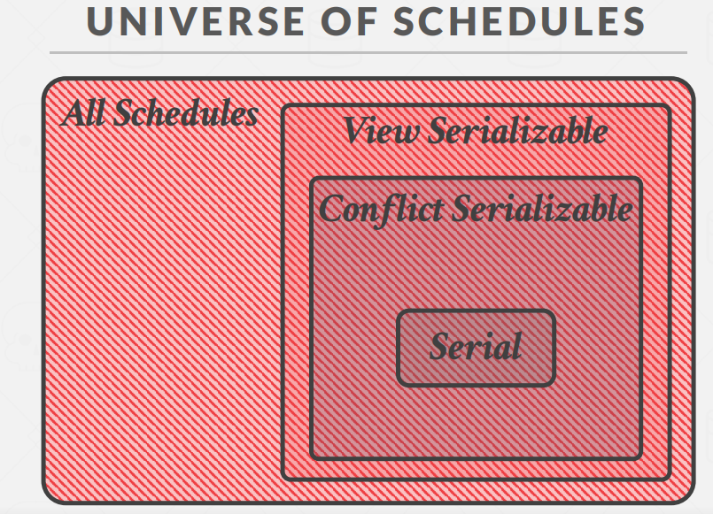

## Durability

已提交的事务的所有更改都应该是持久的