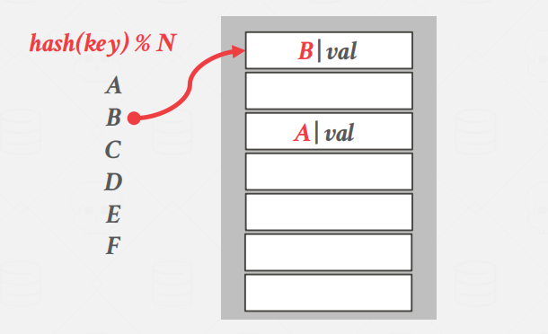
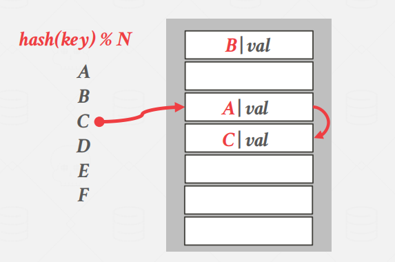
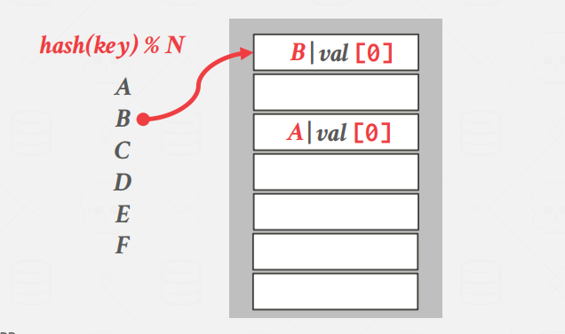
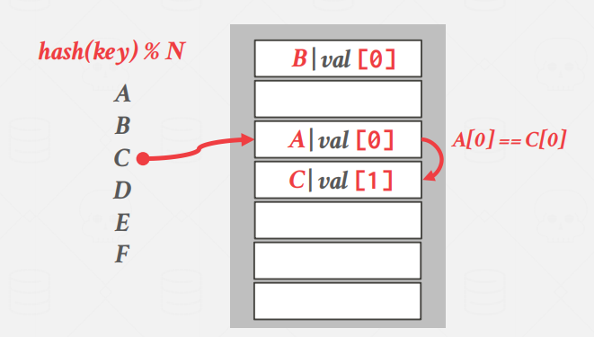
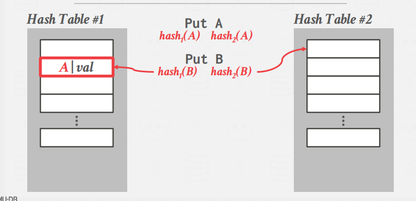
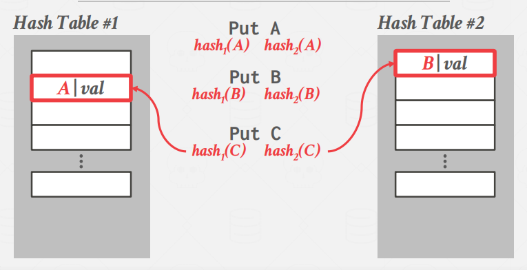
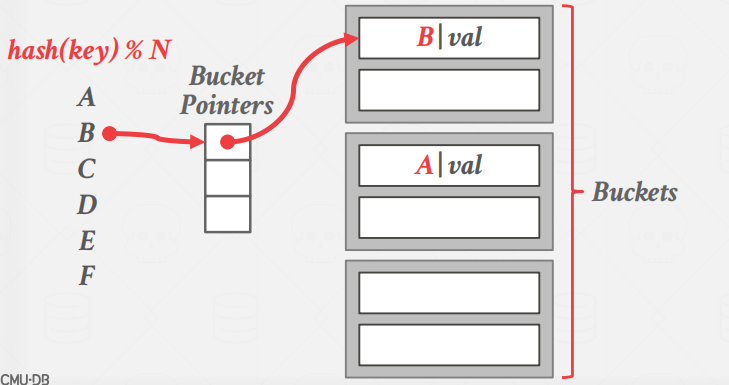
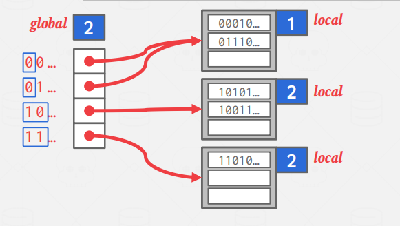
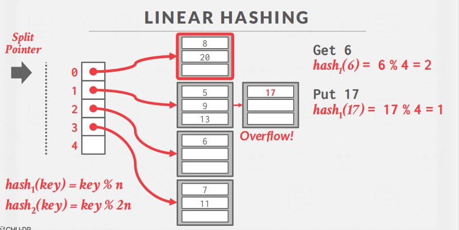

# Hash Table

## Preface

这节我们将讨论如何支持DBMS的执行引擎从页面中读/写数据。

两种类型的数据结构：

- Hash Table
- Tree


在设计这些数据结构时，我们注意2个问题：

- 在内存/页面中如何布局数据结构，以及要存储哪些信息以支持有效的访问。
- 如何使多个线程能够同时访问数据结构而不引起问题。

**Hash Table**

哈希表实现了一个将键映射到值的无序关联数组。它使用一个哈希函数来计算一个给定键在表中所在位置。

空间复杂度：O（n）

时间复杂度：平均O（1），最坏O（n）


## Hash Functions

 hash函数就是把任意长的输入位(或字节)变化成固定长的输出字符串的一种函数。输出字符串的长度称为hash函数的位数。

如果不同的 key 通过哈希函数计算出来的值是一样的，这种情况则成为冲突（哈希碰撞）。

一般来说，计算哈希的速度越快，哈希冲突的概率越大，反之则越低，这就需要在实际设计时进行权衡。摘自：[CMU 15445 学习笔记—5 Hash Table](https://mp.weixin.qq.com/s/bR51NJzZeKOuvEj1KS9J5w)

## Static Hashing Schemes

### **Linear Probe Hashing**

举例：

插入A，先通过hash计算出位置，位置中不存在任何元素，则直接插入。


来了一个B，同样和插入A的计算流程一样，计算出在表中的位置，没有冲突，直接插入。



这时，要来了个C，C的hash值和A相同，那么C将在A的位置后查找空位，找到空位就放入C。



来了个D，D也和表中的元素发送冲突，同类，往后找空位插入即可。


如果是删除操作。

那么有2种方法：

- 一是直接在删除的位置设置一个墓碑值，表示其已被删除。

- 二是移动其他的元素来填充删除的位置，这种方式并不常用


> **NON-UNIQUE KEYS**

当一个Key有多个V时，我们可以将K和V分开存或者联合起来存。如下图。


### **Robin Hood Hashing**

```bash
每个键跟踪它们在表中的最佳位置的位置数量。
在插入时，如果第一个键比第二个键远离其最佳位置，则一个键占用另一个键的插槽。
```

插入A，先通过hash计算出位置，位置中不存在任何元素，则直接插入。同时，A也没有任何偏移，则val值为0。


同理，B与A类似。



这时，来了个C，C的hash值与A类似，因此，综合考虑，将C放在A的后面一位，val值记为1。



D的hash值与C相同，因此，将D放在C的后面一位，val值记为1。


此时，E要存进表中，但是E的hash值和A相同，因此，E要往后放，但是放在哪，根据偏移量val的值的综合考虑（即让所有的val相加尽可能小），所以E放在D的位置上，D往后移动一位。


### **Cuckoo Hashing**

Cuckoo ：杜鹃

杜鹃的在其他鸟的巢中产蛋。

思想：cuckoo hash 使用多个哈希表，并且每个哈希表使用一个不同 seed （随机种子）的哈希函数。当插入数据时，对 key 轮流用每个哈希函数都计算哈希值，如果对应的哈希表有空闲空间，则直接插入。摘自：[CMU 15445 学习笔记—5 Hash Table](https://mp.weixin.qq.com/s/bR51NJzZeKOuvEj1KS9J5w)

2个hash表，分别计算A的hash，查看哪一个Hash有空闲，则放进A。


来了个B，也是和A的计算方法一样。不再叙述啦。



这时，来了个倒霉的C，C的值在表1和表2都发生冲突。



这时候需要选择一个哈希表，将其中的 key 先拿出来，腾一个位置给 C，例如可以将 C 插入到 A 的位置。
然后对 A 再计算哈希值，如果 A 在哈希表 2 中没有冲突，则直接将 A 插入到哈希表 2 中。

摘自：[CMU 15445 学习笔记—5 Hash Table](https://mp.weixin.qq.com/s/bR51NJzZeKOuvEj1KS9J5w)

## Dynamic Hashing Schemes


由于上述的Hash长度都是固定的。

### Chained Hashing

Chained Hash通过一个bucket桶来维护，将发生冲突的值放在同一个桶中。如果一个桶存不下了，就再开一个串联的桶进行存放数据。

每个 bucket 一般会有一个指针，标识其位置，当一个 key 经过 hash 之后，可以通过这个指针找到它所属的 bucket。



###  Extendible Hashing

extendible hash（可扩展哈希）和 chained hash 比较类似，都使用到了bucket 这个概念，同时也会有一个执行 bucket 的指针数组。



###  Linear Hashing



## Conclusion

哈希表是一个高效的数据结构，大多时候能够在 O(1) 的情况下插入和查询数据

注意：哈希适合点查，但是涉及到范围查询就不好使了。