#  **Logging Schemes**

参考资料：

- [logging-schemes](https://zhenghe.gitbook.io/open-courses/cmu-15-445-645-database-systems/logging-schemes#shadow-paging-no-steal-+-force)

## Preface

先来看个例子：

有个事务T1，想要读取A。A原先是在磁盘中的，这时需要将A拉到内存中。

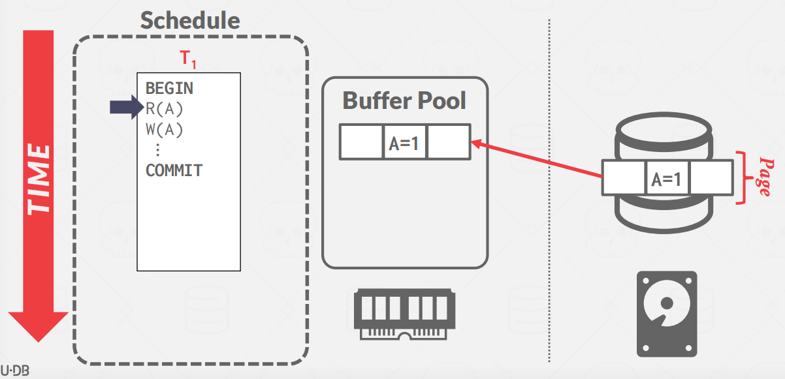

接着，事务T1开始写A，在内存中将A的值修改为2。

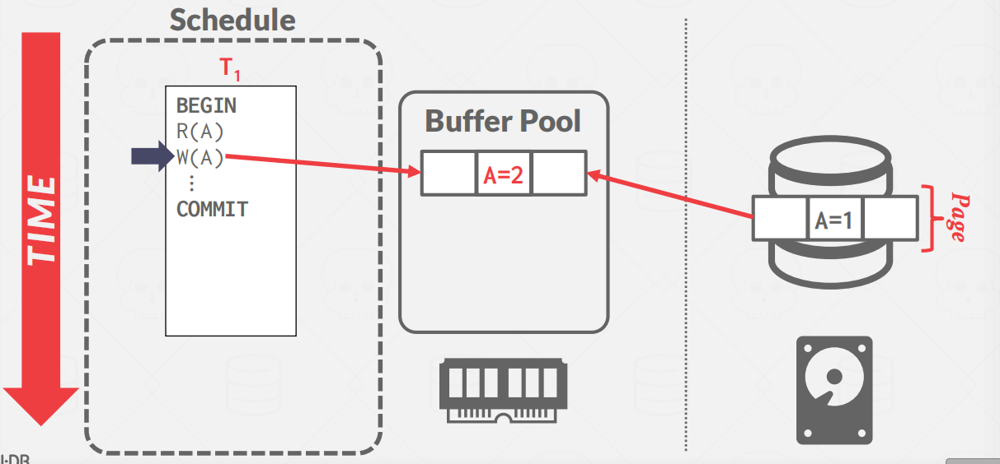

这时，突然断电了，内存中的数据还未来得急保存到磁盘中。因此数据丢失，导致数据库中出现的事务数据不一致的现象。

这时，就需要恢复算法。恢复算法是确保数据库一致性、事务原子性和持久性的技术。当发生崩溃时，内存中未提交到磁盘的所有数据都有丢失的风险。恢复算法可以防止崩溃后的信息丢失。

**每个恢复算法都包括以下两个部分**：

- 在事务执行过程中采取的行动来确保在出现故障时能够恢复 (本节课)
- 在故障发生后的恢复机制，确保原子性、一致性和持久性 (下节课)

## Failure Classification

首先，先来看看故障级别。由于DBMS根据基础存储设备被划分为不同的组件，因此DBMS需要处理许多不同类型的故障。其中一些故障可以恢复，而另一些故障则不能恢复。

**故障类型分为3类：**

1. **事务故障 (Transaction Failures)**

2. **系统故障 (System Failures)**

3. **存储介质故障 (Storage Media Failures)**

> **Transaction Failures**

- 逻辑错误（**Logical Errors**）：由于某些内部错误条件（例如，完整性、约束违反），事务无法完成。
- 内部状态错误（**Internal State Errors**）：由于数据库内部调度、并发控制，如死锁，DBMS必须终止活动事务。

> **System Failures**

- 软件故障（**Software Failure**）：DBMS实现存在问题（例如，未捕获的除零异常），系统必须停止。
- 硬件故障（**Hardware Failure**）：承载DBMS的计算机崩溃（例如，电源拔出电源）。我们假设非易失性存储内容(即磁盘)不会因系统崩溃而损坏。这被称为“故障停止”假设，并简化了进程恢复。

> **Storage Media Failure**

如果存储介质发生故障，通常这样的故障就是无法修复的，如发生撞击导致磁盘部分或全部受损。所有数据库都无法从这种故障中恢复，这时候数据库只能从归档的备份记录中恢复数据。

## Buffer Pool Policies

**修改数据时，DBMS 需要先把对应的数据页从持久化存储中读到内存中，然后在内存中根据写请求修改数据，最后将修改后的数据写回到持久化存储**。在整个过程中，DBMS 需要保证两点：

1. DBMS 告知用户事务已经提交成功前，相应的数据必须已经持久化
2. 如果事务中止，任何数据修改都不应该持久化

如果真的遇上事务故障或者系统故障，DBMS 有两种基本思路来恢复数据一致性，向用户提供上述两方面保证：

- **Undo**：将中止或未完成的事务中已经执行的操作回退
- **Redo**：将提交的事务执行的操作重做

**Example #1**

事务T1读A，DBMS将A在磁盘中指定拉到内存。注意，数据是以页为单位存储的，一页上可能有多个值。

事务T1开始写A，直接在内存中修改。

这时，事务T2开始操作B，注意：A和B在同一页。

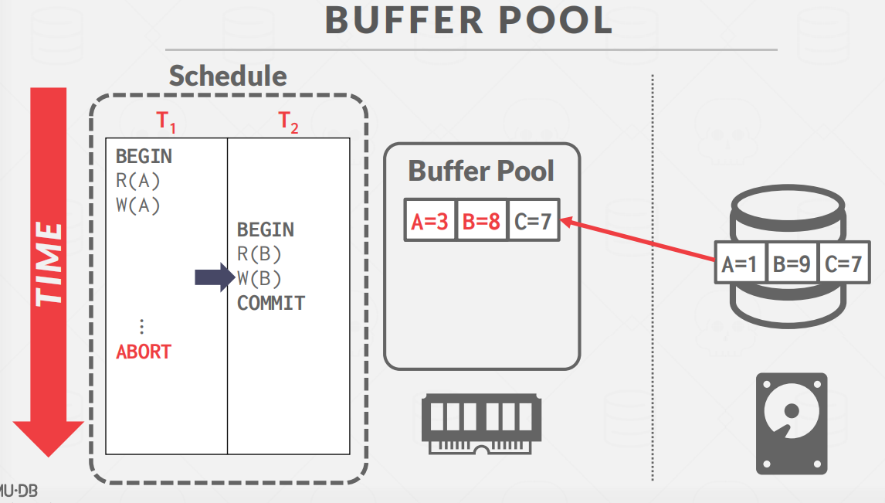

这时，问题来了，事务T2准备提交事务，即将内存中的页存在磁盘中。此时 DBMS 会允许被修改但未提交的 A 数据进入持久化存储吗？

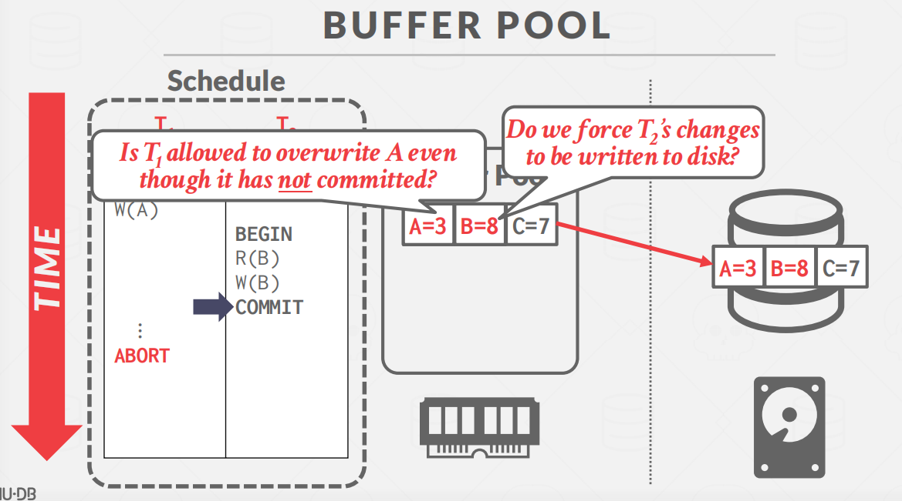

> Steal Policy：DBMS 是否允许一个未提交事务修改持久化存储中的数据？

-  **STEAL**: 允许的

-  **NO-STEAL**: 不允许的

> Force Policy：DBMS 是否强制要求一个提交完毕事务的所有数据改动都反映在持久化存储中？

- **FORCE**: 是需要的
- **NO-FORCE**: 不是需要的

因此，就会产生4 种实现组合。在实践中使用的主要是 **No-Steal + Force** 和 **Steal + No-Force**。

## Shadow Paging

上面说的方案中，最容易实现的缓冲池管理策略称为**No-Steal + Force**。

- 事务中止后，无需回滚数据，因为该事务修改的数据不会被别的事务捎带落盘。
- 事务提交后，无需重做数据，因为该事务修改的数据必然会被落盘持久化。

**【No-Steal + Force】- Example**

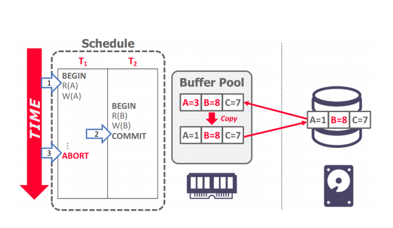

这种策略组合的缺点是"**无法处理写入的数据量超过 buffer pool 大小**"的情况。

**Shadow Paging** 是 **No-Steal + Force** 策略的典型代表，它会维护两份数据库数据：

1. **Master**：包含所有已经提交事务的数据
2. **Shadow**：在 Master 之上增加未提交事务的数据变动

解释：数据库根目录指向主页表，主页表又指向磁盘上的页（所有页都包含已提交的数据）。当发生更新事务时，将创建一个影子页表，它指向与主页相同的页。对磁盘上的临时空间进行修改，并更新阴影表。要完成提交，数据库根指针被重定向到阴影表，阴影表成为新的主表。

在事务提交前，任何被修改的数据都不会被持久化到数据库；在事务提交后，所有被修改的数据都会被持久化到数据库。在 shadow paging 下回滚、恢复数据都很容易：

- Undo/Rollback：删除 shadow pages (table)，啥都不用做
- Redo：不需要 redo，因为每次写事务都会将数据落盘

**缺点**：

shadow paging的一个缺点是，复制整个页表的成本很高。实际上，只需要复制树中导致更新叶节点的路径，而需要复制整个树。此外，阴影分页的提交开销也很高。提交除了需要刷新每个更新的页面外，还需要页面表和根目录。这将导致数据碎片化，而且还需要进行垃圾收集。另一个问题是，这一次只支持一个写入器事务或一个批处理中的事务。

## **Journal File**

当一个事务修改了一个页面时，DBMS会在覆盖主版本之前将原始页面复制到一个单独的日志文件中。重新启动后，如果日志文件存在，则DBMS将其还原为撤消未提交事务中的更改。

**Example #1**

在磁盘区域开辟一块空间存放日志文件。将要修改的页拉到内存中。

DBMS对页面2进行操作，首先先将一份没修改过的版本存在日志文件中。

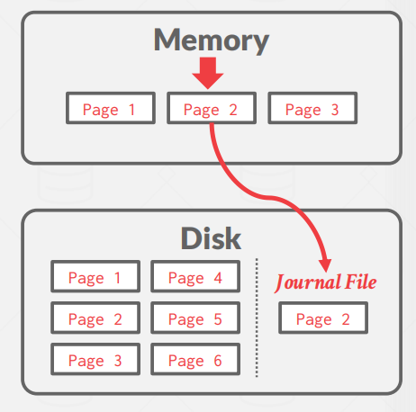

然后再去修改内存中的页。（蓝色表示修改的）

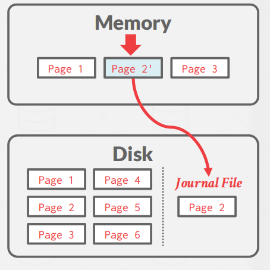

同理，对页面3也是一样

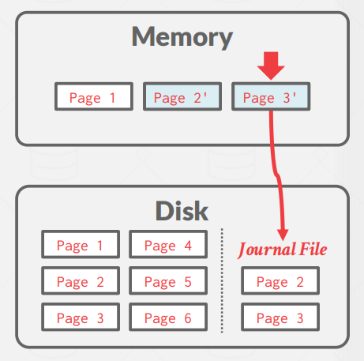

这时，事务提交，就将内存中修改的页覆盖到磁盘页上。

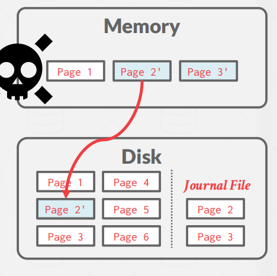

这时，出现了某些意外，内存数据消失了

这时候，就可以用日志文件进行回复操作了。

## Write-Ahead Log

WAL 指的是 DBMS 除了维持正常的数据文件外，额外地维护一个日志文件，上面记录着所有事务对 DBMS 数据的完整修改记录，这些记录能够帮助数据库在恢复数据时执行 undo/redo。使用 WAL 时，DBMS 必须先将操作日志持久化到独立的日志文件中，然后才修改其真正的数据页。通常实现 WAL 采用的 buffer pool policy 为 **Steal + No-Force**。

**Example**

- 当事务开始时，所有更改在进入缓冲区池之前都会记录在内存中的WAL缓冲区中。

- 在提交时，WAL缓冲区将被刷新到磁盘上。

- 一旦WAL缓冲区安全地放在磁盘上，就可以将事务结果写入磁盘。

事务开始时，需要写入一条 `<BEGIN>` 记录到日志中；事务结束时，需要写入一条 `<COMMIT>` 记录到日志中；在事务执行过程中，每条日志记录着数据修改的完整信息，如：

- Transaction Id (事务 id)
- Object Id (数据记录 id)
- Before Value (修改前的值)，用于 undo 操作
- After Value (修改后的值)，用于 redo 操作

DBMS必须将一个事务的所有日志条目刷新到磁盘，然后才能告诉用户（外部人员），一个事务已成功提交。**系统可以使用“组提交”优化来对多个日志刷新进行批处理，以摊销开销**。当日志缓冲区已满，或者在连续刷新之间经过了足够的时间时，就会发生刷新。

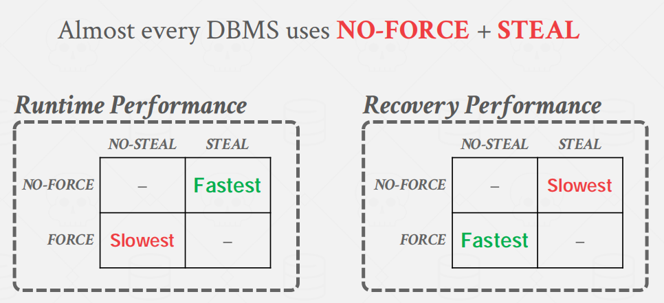

- 运行时效率：No-Steal + Force < Steal + No-Force
- 数据恢复效率：No-Steal + Force > Steal + No-Force

大部分数据库更看重运行时效率，几乎每个DBMS都使用**No-Force +Steal**策略。

## Logging Schemes

- **Physical Logging**
  - 记录对数据库中的特定位置所做的字节级更改。
  - Example: **git diff**
- **Logical Logging**
  - 记录由txns执行的高级操作。
  - Example: **UPDATE**, **DELETE**, and **INSERT** queries
- **Physiological Logging**
  - 对由页面id +插槽号标识的单个元组进行字节级更改的混合方法。
  - 没有指定页面的组织方式。

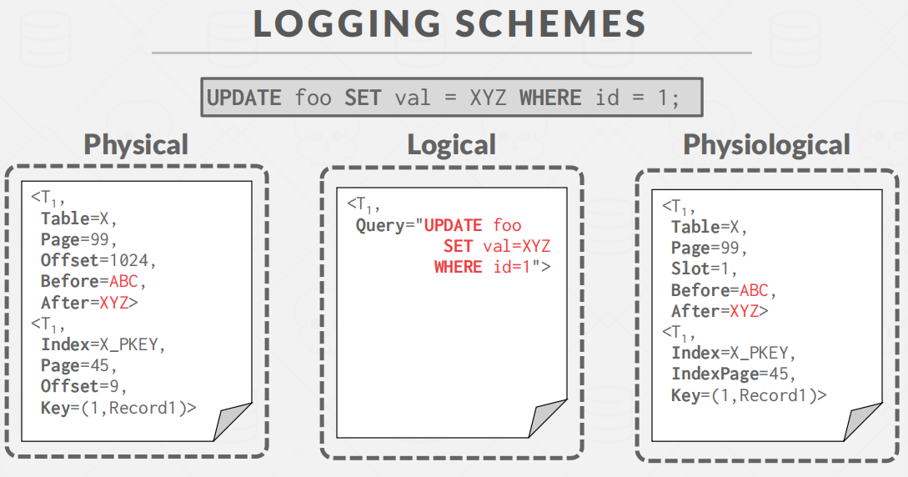

## Checkpoints

基于WAL的DBMS的主要问题是日志文件将永远增长。在崩溃后，DBMS必须重放整个日志，如果日志文件很大，这可能需要很长时间。因此，DBMS可以定期使用一个检查点，将所有缓冲区刷新到磁盘。

当 DBMS 发生崩溃时，所有在最新的 checkpoint 之前提交的事务可以直接忽略，如 T1。

T2 和 T3 在 checkpoint 前尚未 commit。

其中，T2 需要 redo，因为它在 checkpoint 之后，crash 之前提交了，即已经告诉用户事务提交成功；

T3 需要 undo，因为它在 crash 之前尚未 commit，即尚未告诉用户事务提交成功。

**Challenges**

1. 在于要保证 checkpoint 的正确性，我们需要暂停所有事务。

2. 故障恢复时，扫描数据找到未提交的事务可能需要较长的时间。

3. 如何决定 DBMS 执行 checkpoint 的周期，太频繁将导致运行时性能下降；等太久将使得 checkpoint 的内容更多，更耗时，同时数据恢复也要消耗更长的时间。

##  Conclusion

