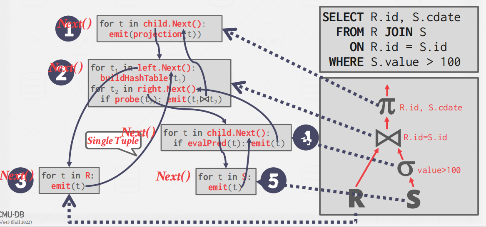
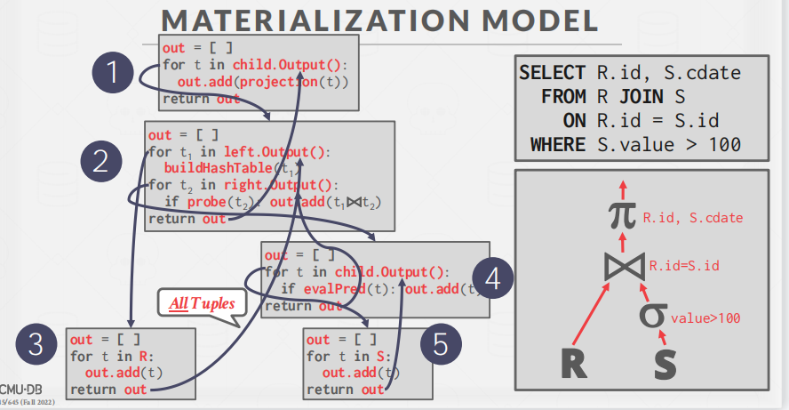
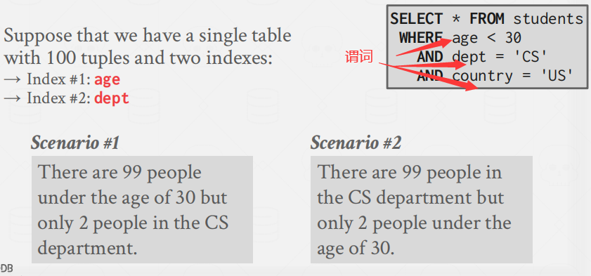
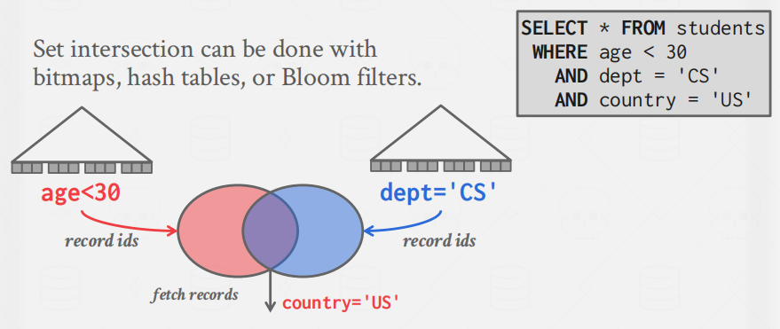
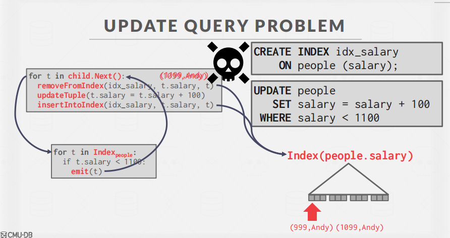

# Query-Execution-1

## Processing Models

###  **Iterator Model**

**Iterator Model**：又称为**Volcano** or **Pipeline** Model。每个查询计划操作符都实现了一个Next（）函数。

- 在每次调用时，如果没有更多的元组，操作符将返回一个元组或返回一个空标记。
- 操作符实现了一个循环，在其子项上调用Next（）来检索它们的元组，然后处理它们。

注意：火山模型是一个一个吐数据。

### **Materialization Model**

**Materialization Model**：每个操作符一次处理其输入，然后一次发出其输出。

- 操作符将其输出“物化”为一个单一的结果。
- DBMS可以向下拉提示（例如，限制），以避免扫描太多的元组。
- 可以发送一个实体化行或单个列

输出可以是整个元组（NSM），也可以是列的子集（DSM）

该模型更适合用于OLTP工作负载，因为查询一次只访问少量的元组。

- 降低执行/协调开销。
- 更少的函数调用。

### **Vectorized / Batch Model**

**Vectorized / Batch Model**：是火山模型和物化模型的中间体。每个操作符发出一批元组，而不是单个元组。

- 一次循环处理多条tuple。
- 批处理的大小可以根据硬件或查询属性而变化。

 

该模型非常适合OLAP查询，因为它大大减少了每个操作符的调用数量。

## Access Methods

Access method：访问方法是指DBMS**访问存储在表中的数据的方式**。

三种基本方法：

1. Sequential Scan
2. Index Scan (many variants)
3. Multi-Index Scan

### **Sequential Scan**

全表顺序扫描遍历：即从磁盘读取page，遍历每个page的tuple。然后执行相应操作。

DBMS维护一个跟踪最后一页的内部游标。

**优化**

- **Approximate Queries (Lossy)**

待填坑。。

- **Zone Maps (Loseless)**

**对页面中的属性值进行的信息统计**。DBMS首先检查区域映射，以决定它是否要访问该页面。

### Index Scan (many variants)

Index Scan：DBMS选择一个索引来查找查询所需的元组。

使用哪个索引需要下列条件：

- 索引包含哪些属性查询引用了哪些属性？
- 索引的值的范围？
- 索引含不含有我要的输出列？
- 谓词压缩
- 索引是否是唯一键或非唯一键？

### Multi-Index Scan

即，我们先用筛选出age<30的信息，同时利用索引检索出dept='CS'的信息。然后取交集，再判断国家是否是‘US’。

## Modification Queries

修改查询涉及到 insert、update、delete。与select不同，他们是对数据库做修改的。与之前的查询操作有些区别。需要进行检查和更新（例如检查约束，更新索引，更新统计信息）

但是这里注意：update和delete有个问题：**算子必须记录这次执行删除了什么数据**

举例：

下面的的SQL语句需要把数据库中每个人薪水效应1100的加上100.

刚开始，红色索引指向收入为99的Andy，满足修改条件。那么就需要先移除Andy这个索引，然后将薪水salary加上100，然后再插回索引。此时，在索引中就出现了（1099，Andy）。随着根节点的继续遍历，又会扫到之前已经更改的现在薪水为1099的Andy，再次对其进行操作。这样的话就会出现重复更新的问题。具体如下图所示。

## Expression Evaluation

DBMS将一个WHERE子句表示为一个表达式树。

树中的节点表示不同的表达式类型：

- Comparisons (**=** , **<**, **>**, **!=**)
- Conjunction (**AND**), Disjunction (**OR**)
- Arithmetic Operators (**+**, **-**, *****, **/**, **%**)
- Constant Values
- Tuple Attribute References

但是下面这种执行就会产生很大的效率问题。

因为每次查询都要不断的计算 ? + 1。一个好的解决办法是提前算出来 ? + 1 的值。

SQL语句中使用 WHERE 1 = 1 这种谓词

像这样的语句，数据库一般会直接把这条恒真的语句干掉。

## **CONCLUSION**

- 相同的查询计划可以以多种不同的方式执行。
- （大多数）dbms将希望尽可能多地使用索引扫描
- 表达式树很灵活，但速度很慢。JIT编译（有时）加快其速度