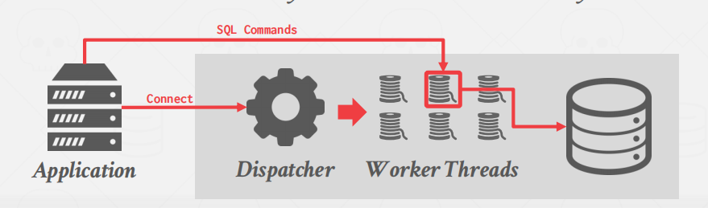
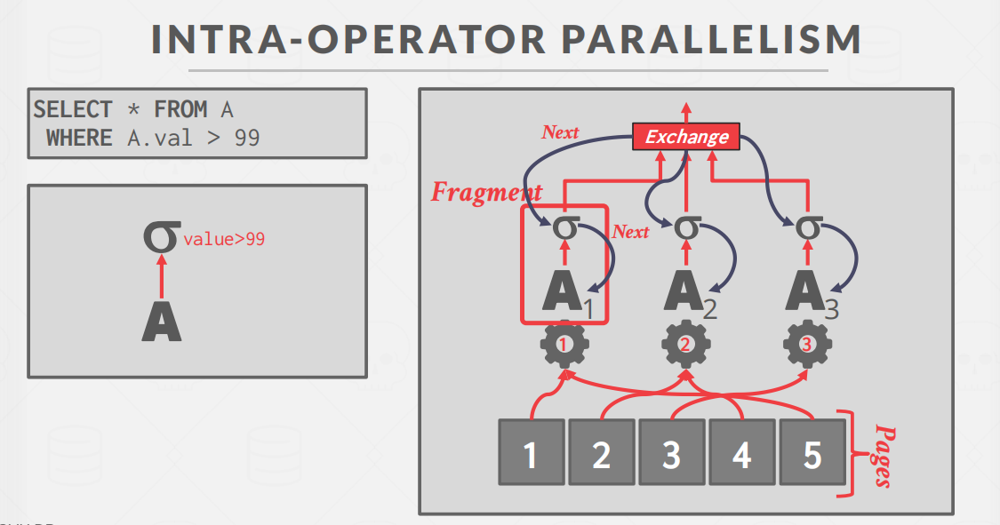
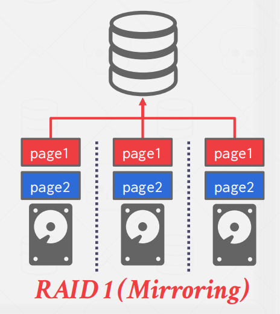

# Query-Execution-1

## Preface

前面的部分我们只研究单进程，现在我们为了提高性能，需要并行的执行。

特点

- 高吞吐量
- 低延迟
- 提高了系统的响应性
- 可能会降低 **total cost of ownership**（TCO）

> **Parallel VS Distributed**

并行DBMS

```
资源在物理上是较为接近的。
资源高速内部通信。
通信被认为是廉价和可靠的。
```

分布式DBMS

```
资源彼此之间很遥远。
资源之间的通信很慢。
通信成本和问题都不容忽视。
```

## Process Models

**Process Models**：线程模型

一个DBMS的线程模型定义了如何构建系统以处理来自多用户应用程序的并发请求。

A worker是DBMS组件，它负责代表客户机执行任务并返回结果。就像DBMS的工人。

### **Process per DBMS Worker**

**Process per DBMS Worker**：每个worker分配一个进程。

每个worker都是一个单独的OS操作系统进程。

特点：

- **依赖于操作系统调度**程序。
- 对全局数据结构使用**共享内存**。
- 进程崩溃不会关闭整个系统。


Dispatcher：分配器

常见的数据库： IBM DB2, Postgres, Oracle

缺点：进程较为吃系统资源。

### **Thread per DBMS Worker**

**Thread per DBMS Worker**：每个worker一个线程。

特点：

- DBMS（大部分）管理自己的调度。
- 可能使用或不使用**调度程序线程**。
- 线程崩溃（可能）杀死整个系统。



常见的数据库：MSSQL, MySQL, DB2, Oracle (2014)

> **SCHEDULING**

对于每个查询计划，DBMS将决定在何处、何时以及如何执行它：

- 一个执行计划需要切分成多少任务？
- 每个任务需要占用多少CPU资源？
- 哪些CPU资源执行哪些任务？
- 单个任务结果输出到哪里？子任务如何聚集？

尽可能让DBMS控制，而不是让OS控制。

### **Embedded DBMS**

数据库的使用模式是在应用程序的相同地址空间中运行系统的，这与数据库独立于应用程序的客户机-服务器模型相反。在此场景中，应用程序将设置要在数据库系统上运行的线程和任务。应用程序本身将主要负责调度。


常见的数据库：DuckDB, SQLite, and RocksDB

> **PROCESS MODELS**

多线程体系结构的优点：

1. 减少每个上下文切换的开销。
2. 不必管理共享内存。

## Execution Parallelism

> **Inter-Query AND Intra-Query Parallelism**

**Inter-Query**：同时执行多个不同的查询。（增加吞吐量和减少延迟）

**Intra-Query**：并行地执行单个查询的操作。（减少了对于长时间运行的查询的延迟，特别是对于OLAP查询）

### **Intra-Operator (Horizontal)**

- 将**操作符分解为独立的fragments**，在不同的数据子集上执行相同的功能。


将操作符分解为独立的片段，在不同的数据子集上执行相同的功能。



###  **Inter-Operator (Vertical)**

- 操作是重叠的，以便将数据从一个阶段传输到下一个阶段，而不需要实体化
- Worker同时从查询计划的不同部分执行操作员。

也称为：**pipeline parallelism**


### **Bushy**

前两者的结合体。


## I/O Parallelism

数据库系统的瓶颈基本是磁盘的性能。

跨多个存储设备拆分DBMS：

- 一个数据库划分存储在多个磁盘上。这样可以在磁盘层面分离出DBMS，在磁盘的层面上多并发。有点像RAID。
- 一个数据库存在一个磁盘上
- 一个表存在一个磁盘
- 一个表切分在不同的磁盘上

其实本质都是将数据切分开。

摘自：[CMU15-445数据库系统：查询执行II](https://gaozhiyuan.net/database/cmu-database-systems-query-execution-part-ii.html)


磁盘阵列（Redundant Arrays of Independent Disks，*RAID*）：[RAID磁盘阵列是什么意 RAID 0、1、5都有什么不同](https://www.ixigua.com/6764516794855064071?wid_try=1)

### **Multi-Disk Parallelism**

在多磁盘并行性中，操作系统/硬件被配置为跨多个存储设备存储DBMS的文件。这可以通过存储设备或RAID配置来实现。所有的存储设置对DBMS都是透明的，所以worker不能在不同的设备上操作，因为DBMS不知道底层的并行性。



这对DBMS是透明的。

### **Database Partitioning**

这部分摘自：[CMU15-445数据库系统：查询执行II](https://gaozhiyuan.net/database/cmu-database-systems-query-execution-part-ii.html)

数据库分区


把这个表分成两部分，将其存放在不同的磁盘上，利用磁盘并行优化。


另外，我们发现最后一个字段非常的大，所以**又长又冷的数据我们尽量拆分开**。如果DBMS不支持表分区你也要尽量在数据库设计的时候**拆分成两张表**。

如果数据库系统支持的话，可以使用分区键（partitioning key）来实现表分区。