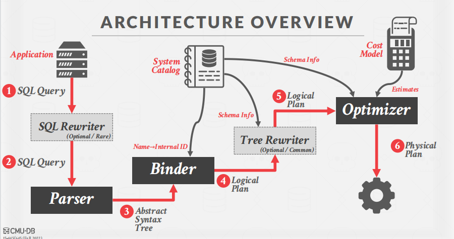
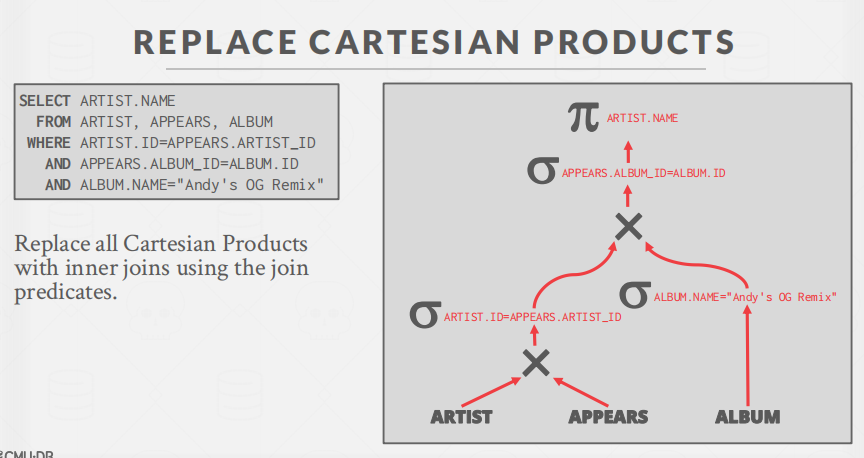
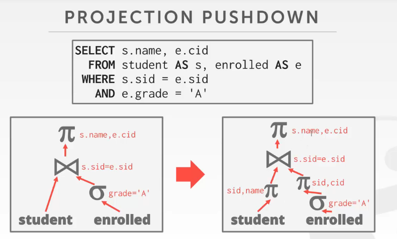
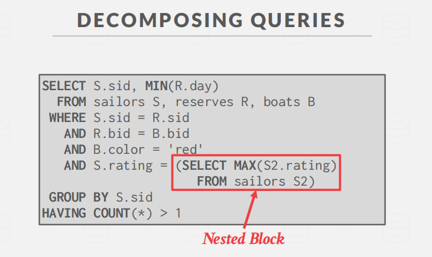
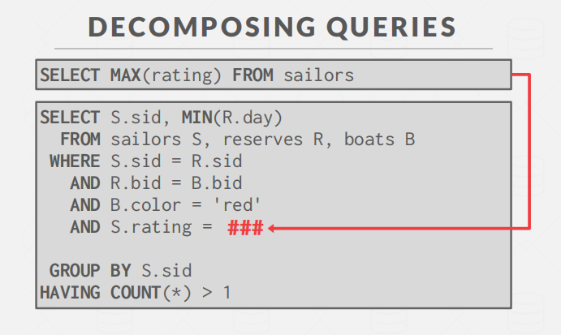
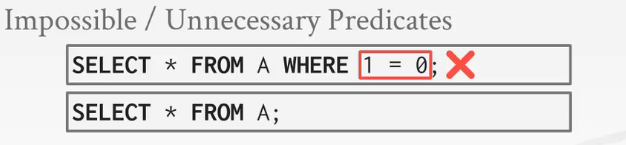
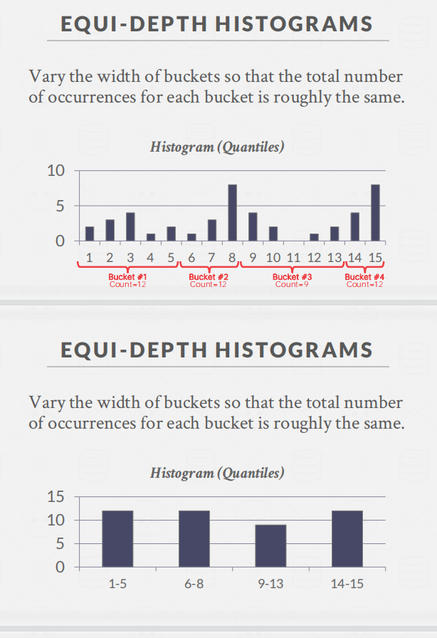

# Query-Planning&Optimization

参考资料：

- [CMU15-445数据库系统：查询优化I](https://gaozhiyuan.net/database/cmu-database-systems-query-planning-part-i.html)
- [CMU15-445笔记-优化篇](https://zhuanlan.zhihu.com/p/375186784)

**体系结构概述**

**QUERY Optimization**

-  Heuristics / Rules

  -  重写查询以删除愚蠢的/低效的东西
  -  这些技术可能需要检查目录，但它们不需要检查数据。（例如数据库系统会去探查我们的列上面有没有索引，如果有的话就直接走索引。但是数据库系统不会去再详细的看这列的统计信息，他只关心基础信息，有或者没有）摘自：[CMU15-445数据库系统：查询优化I](https://gaozhiyuan.net/database/cmu-database-systems-query-planning-part-i.html)
-   Cost-based Search
   -  使用一个模型来估计执行一个计划的成本。
   -  为一个查询枚举多个等效计划，并选择成本最低的一个。

## Heuristic/Ruled-based Optimization

关系代数有一些基本的运算率，经过这些运算率变换的关系代数表达式是等效的。而基于规则的优化就是利用这些运算率，生成最小代价的Logical Plan，在这一步只需要定义一些规则，然后匹配pattern利用规则。摘自:[CMU15-445笔记-优化篇](https://zhuanlan.zhihu.com/p/375186784)

### Logical Query Optimization

>  **Split Conjunctive Predicates** 

**谓词分解：**多个简单的谓词要比一个复杂的谓词更好优化

>  **Predicate Pushdown**

**谓词下推：**提前利用谓词筛选数据

> **Replace Cartesian Products with Joins**

将笛卡尔乘积转化为内连接。

> **Projection Pushdown**

**投影下推：**将投影规则下推到scan那一层，使得内存中保存的数据更少.

###  **Nested Sub-Queries**

- 方法1：重写语句

- 方法2：解耦

原先每次执行都需要执行select语句，效率低下。

因此，可以把这条语句拿到外面，提前算好。

### Expression  Rewriting

例子1：

例子2：相当于`select * from A`

例子3：

## Query Cost Models

需要在同一个数据库系统中比较。代价有下列几种：

### **Physical Costs**

- 预测CPU周期、I/O、缓存丢失、RAM消耗、网络消息

- 很大程度上依赖于硬件

###   Logical Costs

- 估计每个操作员的输出大小
- 独立于算子算法。
- 需要估计操作员的结果大小

### **Algorithmic Costs**

- 算子算法实现的复杂性。

## Cost-based Optimization

**提示**：本节摘自： [CMU15-445笔记-优化篇](https://zhuanlan.zhihu.com/p/375186784)

Cost Based主要关注的是那些需要具体数据具体分析的优化（比如Join的顺序，scan的执行方法等）。对于Cost Based方法，其主要分为三个模块

- Cost Model：代价的评估策略
- Statistics：统计信息的维护
- Plan Enumeration：搜索最优的计划

### Cost Model

假设数据是均匀分布的，且：

- N(R)：代表关系R的tuple数量
- V(A, R)：代表关系R中attribute A的value数量（不重复的），即A有多少种取值。即给A的集合去重后的个数。

这里以谓词举例，我们需要计算的是谓词P，筛选出的数据所占总数据的比例，也就是**selectivity(sel)。**

由于**数据均匀分布**，我们可以计算Attribute A种每个值所包含的tuple数为：**SC(A,R)=N(R)/V(A, R)**。

那么针对不同的谓词，其sel为

- **Equality：sel(A=constant)=SC(P)/V(A,R)**
- **Range Predicate：sel(A>=a)=(Amax-a)/(Amax-Amin)**
- **Negation Query：sel(notP)=1-sel(P)**
- **Conjunction Query：sel(P1^P2)=sel(P1)*sel(P2)**。这里各个谓词需要独立
- **Disjunction Query：sel(P1∪P2)=sel(P1)+sel(P2)-sel(P1^P2)**

注意：选择性计算的假设（以上的计算都是基于下方假设作为前提的）

- 均匀数据：数值的分布是相同的。
- 独立谓词：属性上的谓词都是独立的。
- 包含原则：连接键的域重叠，这样内部关系中的每个键也将存在于外部表中。

但是，真实的数据往往不能满足这些假设。因此需要其他的方法。

### Statistics

**等宽直方图：**如果数据整体上不是uniform，但是局部是，这样就可以局部的使用上述的规则。

**等深直方图：**与等宽直方图不同的是，等深直方图是深度相似

**Sketches：**生成对应数据的概率分布，而不是直方图，精确度更高。有**Count-Min Sketch，**近似的统计每个数据出现的频率，和**HyperLogLog，**近似统计每个数据集的基数大小（V(A，R)）

**Sampling：**可以采样一个子集，然后通过部分估计总体

### Plan Enumeration

接下来便是对查询树的实际优化。查询计划可以分为两类：

- Single Relation：只针对单个关系的查询，多见于OLTP事务中
- Multiple Relation：针对多个关系的查询，多见于OLAP事务中

Single Relation查询往往比较简单，只需要使用简单的Rule based方法并选择最好的access method即可。

多余Multi-Relation查询会更复杂，尤其是涉及到连接顺序时。445介绍了System-R中的优化策略。

首先，为了减少搜索空间，join tree都是left-deep join tree，如下图所示

使用动态规划算法自底向上的来减少代价。