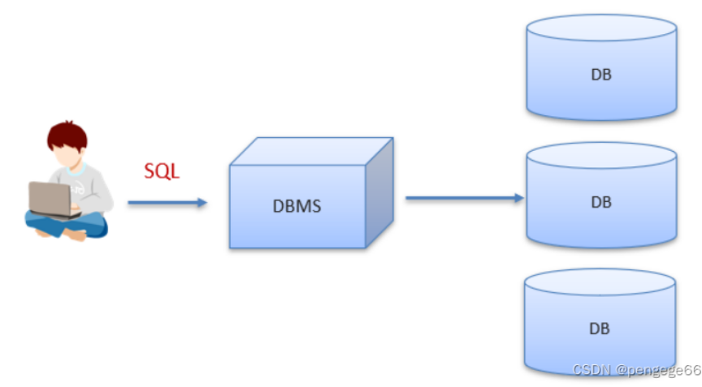

# 01 - Relational Model

## Intro

**数据库**：它是以某种⽅式去进⾏关联的数据集合。

数据库就是将数据存储在硬盘上，可以达到持久化存储的效果。

**数据库管理软件**是⼀种专业软件，它允许程序在⽆须关⼼底层实现的情况下，对数据库中的信息进⾏存储和分析。

例如，在电脑上安装了数据库管理系统后，就可以通过数据库管理系统创建数据库来存储数据，也可以通过该系统对数据库中的数据进行数据的增删改查相关的操作。我们平时说的MySQL数据库其实是MySQL数据库管理系统。（ SQL - Structured Query Language）




## Relational Model

关系模型基于关系定义了一个数据库抽象，以避免维护开销.

- 存储数据库在简单的数据结构（关系）
- 物理存储留给DBMS实现。
- 通过高级语言访问数据，DBMS可以找出最佳的执行策略。

关系模型包含三部分：数据结构、数据完整性约束、数据操作

```bash
结构：对数据库的关系及其内容的定义
完整性：确保数据库的内容满足约束条件
操作：用于访问和修改数据库内容的编程接口
```

## RELATIONAL ALGEBRA


