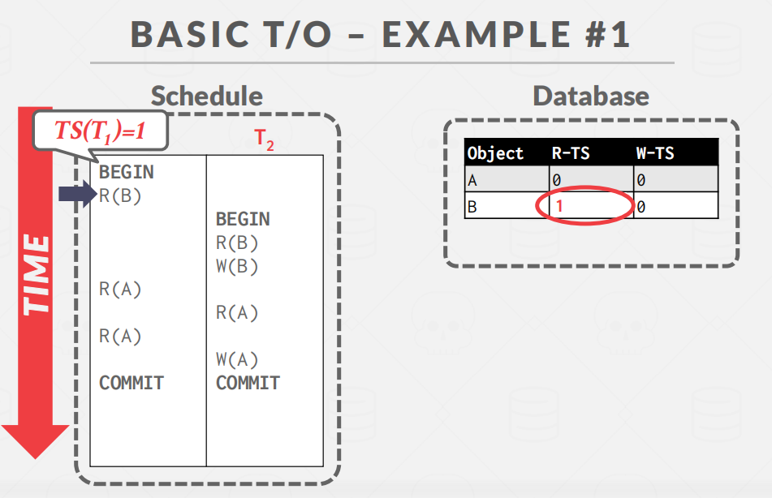
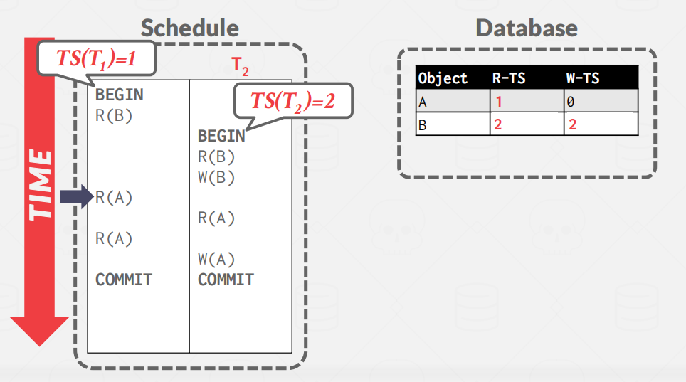
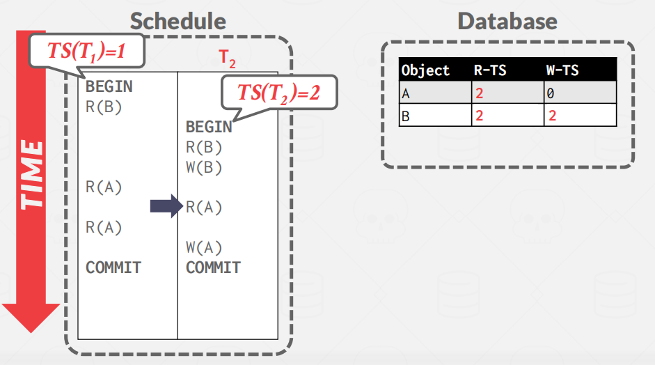
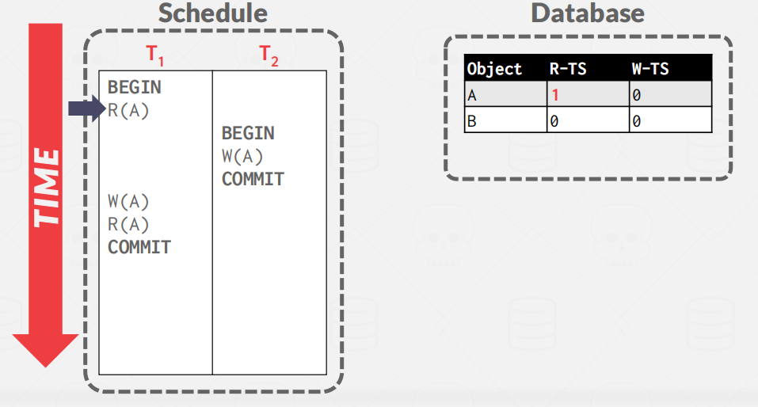
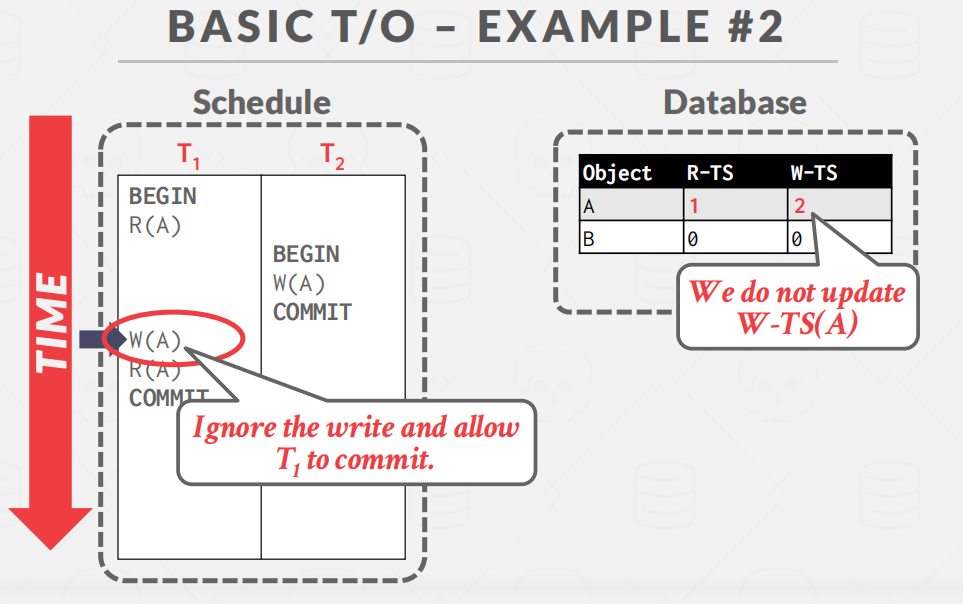
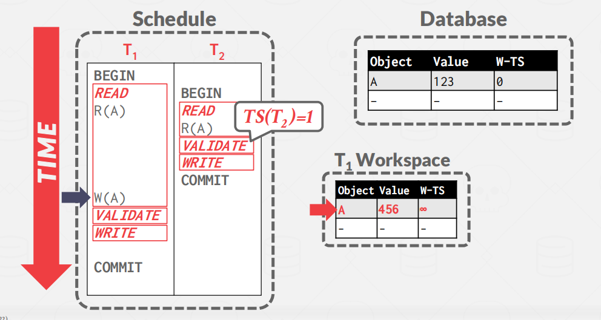
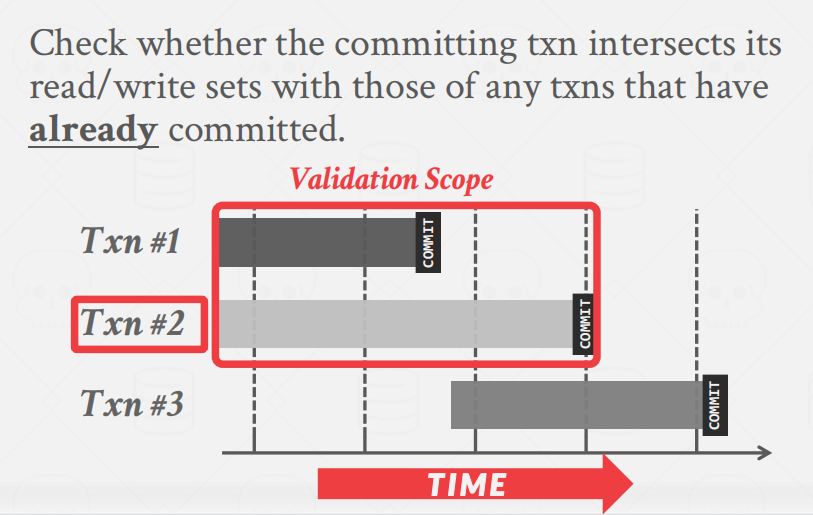
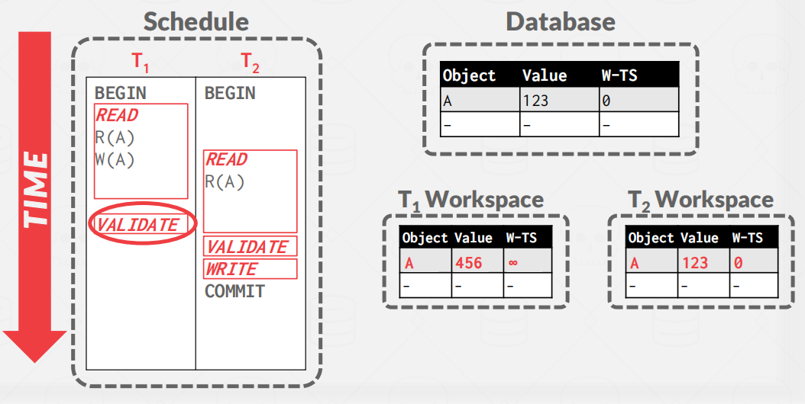
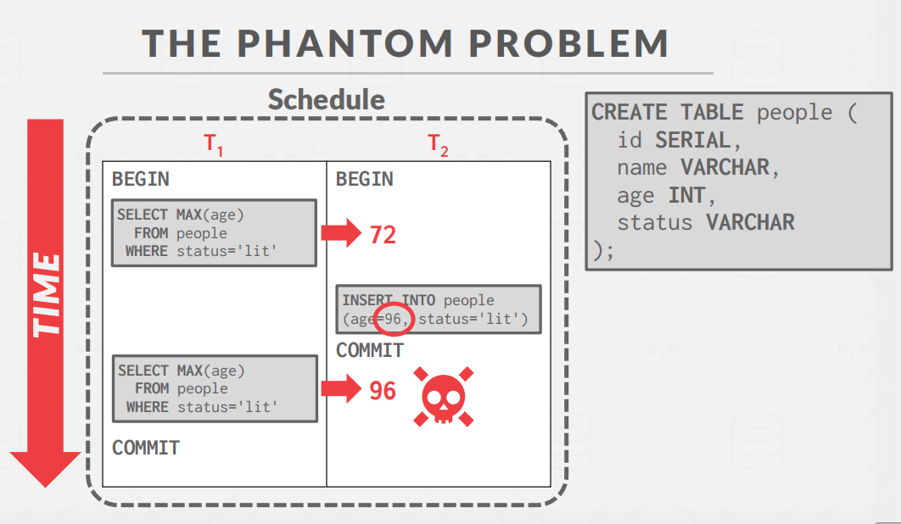

# Timestamp-Ordering-Concurrency-Control

参考资料：[Timestamp Ordering Concurrency Control](https://zhenghe.gitbook.io/open-courses/cmu-15-445-645-database-systems/timestamp-ordering-concurrency-control)

时间戳顺序（T/O）是一种乐观的并发控制协议，其中DBMS假定事务冲突很少发生。DBMS不是要求事务在允许读写数据库对象之前获取锁，而是使用时间戳来确定事务的可序列化性顺序。

T/O 的核心思想就是利用**时间戳来决定事务之间的等价执行顺序**：**如果TS(Ti)<TS(Tj)，那么数据库必须保证的`schedule`与先执行Ti再执行Tj的结果等价。**

**多种实施策略**：

1. System/Wall Clock（系统单调时钟 ）
2. Logical Counter.（逻辑计数器）
3. Hybrid.

但是，存在**溢出**和**具有多台机器的分布式系统**维护计数器方面存在问题。

## Basic Timestamp Ordering (T/O) Protocol

**Basic Timestamp Ordering (BASIC T/O)**

在 Basic T/O 中，事务读写数据**不需要加锁**，每个对象X都标记了最后一个成功读写的**txn的时间戳**：

- W-TS(X)：最后一次写 X 发生的时间戳
- R -TS(X)：最后一次读 X 发生的时间戳

然后，DBMS会检查每个操作的这些时间戳。如果txn试图访问一个未来的对象（是否读取或写入了未来的数据），它将中止并重新启动。

> **Basic T/O Reads**

读取数据的逻辑：

```go
func read(X) val {
    if TS(T_i) < W_TS(X) {
        abort_and_restart(T_i)
    } else {
        val := read_data(X)
        R_TS(X) = max(R_TS(X), TS(T_i))
        // make a local copy of X to ensure repeatable reads for T_i
        return val
    }
}
```


> **Basic T/O Write**

写入数据的逻辑：

```go
func write(X, val) {
    if TS(T_i) < R_TS(X) || TS(T_i) < W_TS(X) {
        abort_and_restart(T_i)        
    } else {
        X = val
        W_TS(X) = max(W_TS(X), TS(T_i))
        // make a local copy of X to ensure repeatable reads for T_i
    }
}
```

> **Basic T/O - Example #1**

如下图，有2个事务T1和T2，时间戳分别为1和2。（即事务T1先执行）


事务T1对B进行读操作，合理，并且修改R-TS，置为T1的时间戳：1。



之后，事务T2开始，事务T2也对B读操作，由于B的R-TS为1，事务T2的时间戳为2，那么事务T2并未访问未来的数据，也就是可以读。之后T2又对B进行写操作。


T1 读取 A，将 W-TS(A) 更新为 1



T2也 读取 A，将 W-TS(A) 更新为 2



T1又读A，根据前面读的规则，是允许的。


之后，事务T2再写A


> **Basic T/O - Example #2**

T1读A，R-TS修改为1



T2写A，W-TS修改成2


当T1修改A时，出现冲突，T1事务则会中断或重启。


> **Optimization: Thomas Write Rule**

规则：

```c++
if TS(Ti)<R-TS(X):
	中止or重启Ti
if TS(Ti)<W-TS(X):
	Thomas Write Rule:忽视写，让事务继续进行
	理解：因为有个未来的事务修改了，我们假设我们已经完成了写操作，反正未来都有事务对齐进行修改，当作覆盖
else:
	允许Ti写入X并更新W-TS (X)
```

> **Basic T/O - Example #2**

回到刚刚的例子2：

按照之前的规则，执行到这步，事务A应该中止，但是现在有了**Thomas Write Rule**，我们就可以忽视，继续去执行。



基础的T/O的特点：

- 不会产生死锁，因为没有锁。

- 长事务容易因为与短事务冲突而饿死。

## Optimistic Concurrency Control

OCC 是 H.T. KUNG 在 CMU 任教时提出的并发控制算法。在OCC中，DBMS会为每个事务**创建一个私有工作区**。**对事务处理进行的所有修改都将应用于此工作区。**：

- 读取的任何对象都被复制到工作区中
- 写入的任何对象都被复制到工作区并在那里进行修改
- 任何其他事务都无法读取其专用工作区中的其他事务所做的更改。
- 当事务提交时，DBMS将比较事务的工作区写集，以查看它是否与其他事务冲突。如果没有冲突，则将写集安装到“全局”数据库中。

**OCC有3个阶段**

1. **Read Phase**：追踪、记录每个事务的读、写集合，并存储到私有空间中
2. **Validation Phase**：当一个txn提交时，检查它是否与其他txns冲突
3. **Write Phase**：如果验证成功，DBMS将将专用工作区更改应用到数据库。否则，它将中止并重新启动事务

> **OCC - Example**

事务T1读A，将A复制到自己的工作区。这里看到，OCC只需要记录`W-TS`一个时间戳。


这时候T2也读A，同样也将A复制到自己的工作区。


T2完成了所有操作，进入验证阶段，获得了系统给定的时间戳TS(T2)=1，由于没有写操作，完成commit


T1开始对A进行写操作。T1先在本地（自己的工作区）将A修改为456，由于还没获得系统给定的时间戳，就先设置为∞，



T1完成所有的操作，开始验证阶段，获得时间戳TS(T1)=2，写阶段检查。最后提交到数据库。


> **OCC - Read Phase**

追踪事务的读写集合 (read/write sets)，将 read set 存放在 private workspace 中用来保证 repeatable read，将 write set 存放在 private workspace 中用来作冲突检测。

> **OCC - Validation Phase**

在进入 Validation Phase 后，每个事务都会被赋予一个时间戳，然后与其它正在运行的事务执行 Timestamp Ordering 检查，检查的方式有两种：

1. Backward validation
2. Forward validation 

**Backward validation**

如下图所示，现在txn2准备提交，需要检查在**txn2之前的事务**（txn1）读写集合是否存在交集。



**Forward validation**

与此类似，在 Forward Validation 中，需要检查待提交的事务 (txn #2) 的读写集合是否与尚未提交的事务的读写集合存在交集：


如果`TS(Ti) < TS(Tj)`，那么以下 3 个条件之一必须成立

1. Ti completes all three phases before Tj begins its execution (serial ordering).

   如果事务 Ti 在事务 Tj 开始之前已经完成 OCC 的所有 3 个阶段，那么二者之间不存在任何冲突。

   

2. Ti completes before Tj starts its Write phase, and Ti does not write to any object read by Tj。

   -  **WriteSet(Ti) *∩* ReadSet(Tj ) = ∅.**

   则二者不存在冲突。

   Ti在Tj开始写阶段就完成提交，并且Ti没有修改任何Tj读的数据。
   
   ex1:下面是有问题的，因为不是serial。因为T1先进入验证阶段，那么T2读取到的A是保存到本地的123，但是根据serial顺序执行，T2读取到的A应该是456，即T1修改的。因为T1的时间戳先于T2。



ex2:下面的这个例子就是serial顺序执行。因为T2先提交。


3. Ti  completes its Read phase before Tj completes its Read phase, and Ti  does not write to any object that is either read or written by Tj .
   - WriteSet(Ti) ∩  ReadSet(Tj) = ∅,
   - and WriteSet(Ti) ∩ WriteSet(Tj ) = ∅.
   
   T1完成读阶段之前Tj完成读阶段，同时Ti没有修改任何Tj读取或修改的数据。
   
   则二者不存在冲突。

OCC 与 Basic T/O 的思路类似，都是在检查事务之间的 WW、WR 冲突。当冲突发生的频率很低时，即：

- 大部分事务都是读事务
- 大部分事务之间访问的数据间没有交集

2PC 的性能瓶颈在于锁管理，尽管 OCC 没有加锁的成本，但它也存在性能问题:

- 将数据本地复制到事务的私有工作区的高开销。
- 验证/写入阶段的瓶颈。
- 中止可能比其他协议中更浪费，因为它们只在事务已经执行之后才发生。
- 遭受时间戳分配瓶颈

> **Dynamic Databases**

目前为止，我们只处理了读取和更新数据库中现有对象的事务。但是现在，如果txns执行插入、更新和删除，就会有新的问题。

**Phantom Read**



解决方案：

-  **Re-Execute Scans**
-  **Predicate Locking**
-  **Index Locking**

## Isolation Levels

**Serializability**是有用的，因为它允许程序员忽略并发性问题，但强制执行它可能允许太少的并行性和限制性能。我们可能希望使用一个较弱的一致性水平来提高可伸缩性

更弱的数据库隔离级别将事务修改的数据暴露给其它事务，以此提高整体并发度，但这种并发度可能造成一系列问题，如 Dirty Reads/Writes (脏读、脏写)、Unrepeatable Reads (不可重复读)、Phantom Reads (幻读) 等等。

- **Dirty Read:** 读取未提交的数据。
- **Unrepeatable Reads:** 重新执行一个读取的结果会产生不同的结果。
- **Phantom Reads:** 插入或删除会导致相同范围的扫描查询产生不同的结果

**隔离等级（最强到最弱）：**


```bash
1.读未提交（Read Uncommitted）：
最低级别的隔离级别，一个事务可以读取到另一个事务未提交的数据，可能会出现脏读、不可重复读和幻读等问题。

2.读已提交（Read Committed）：
一个事务只能读取到另一个事务已经提交的数据，避免了脏读问题，但仍可能出现不可重复读和幻读问题。

3.可重复读（Repeatable Read）：
一个事务在执行期间读取到的数据始终保持一致，不受其他事务的影响，避免了不可重复读问题，但仍可能出现幻读问题。

4.串行化（Serializable）：
最高级别的隔离级别，所有事务必须按顺序依次执行，避免了所有并发问题，但也牺牲了系统的并发性能。
```


**总结：任意一种并发控制都可以被分解成前两节课中提到的基本概念。**